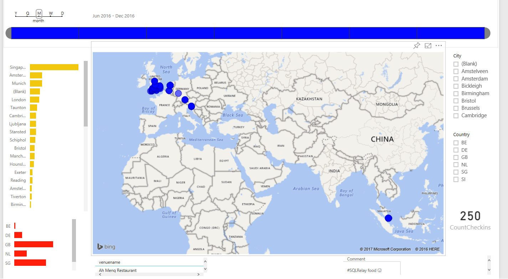

Its the time of year for reflection and I have had the most amazing 2016, I am blessed that I love what I do so much. I thoroughly enjoy writing and talking and sharing and commenting and supporting and cherishing all the SQL and PowerShell things. [I wrote about using Power Bi to display my checkins](http://sqldbawithabeard.com/2016/10/29/powerbi-and-api-visualising-my-checkins/). I only started this in June and this is where I have been :-)

I learnt about [Pester](https://github.com/pester/Pester) and ended the year incorporating it into [dbatools](https://dbatools.io) and [dbareports](https://dbareports.io). I also started using [GitHub](https://github.com/SQLDBAWithABeard) It is quite surprising to me how much time I now spend using both. I also had to start learning [DSC](https://msdn.microsoft.com/en-us/PowerShell/dsc/overview) for the client I was working with because as 'the PowerShell guy' I was the one who could the easiest. I learnt things and [then forgot them causing me to find this Pester post via google later in the year!!](http://sqldbawithabeard.com/2016/01/31/PowerShell-pester-the-script-failed-due-to-call-depth-overflow/) (That's a big reason for blogging by the way)

Early in the year we organised with [SQL Saturday Exeter](http://www.sqlsaturday.com/496/EventHome.aspx)

https://www.facebook.com/mark.pryce.maher/videos/10153333580360863/?pnref=story.unseen-section

<blockquote class="twitter-tweet">
Getting ready for <a href="https://twitter.com/hashtag/SQLSatExeter?src=hash">#SQLSatExeter</a> session selection. Wish us luck 124 into 26

— Rob Sewell (@sqldbawithbeard) <a href="https://twitter.com/sqldbawithbeard/status/689535662509408258">January 19, 2016</a></blockquote>Helping to organise a SQL Saturday is a lot of fun, especially when you do it with good friends, but choosing sessions is by far the most challenging part of it for me. I could have chosen at least 60 of these sessions and I know people were disappointed not to have been chosen. I was also the first person many saw at SQL Bits in Liverpool manning the front of house and [getting asked the best question ever](http://sqldbawithabeard.com/2016/05/10/a-day-in-the-life-of-a-sqlbits-volunteer/)

The Beard says

> When you go to an event -  Say thank you to the organisers and volunteers

and a TERRIBLE thing happened - I broke my DBA Team mug

Luckily the fine folk at [redgate](http://www.red-gate.com/) sorted me out with a replacement from deep in the stores somewhere and gave it to me at SQL Saturday Exeter :-) Thank you.

I spoke at the PowerShell Conference Europe and met and made some great friends which lead to me speaking at the PowerShell Monday in Munich and the Dutch PowerShell Usergroup. SQL Saturday Dublin was a blast, its a wonderful city, Manchester had a whole PowerShell Track :-) and Cambridge was memorable for the appalling journey as well as the chance to share a stage with [Chrissy](https://twitter.com/cl). PowerShell Conference Asia in the sovereign city-state of Singapore was such a good event and place. Lastly of course was Slovenia with its fantastic Christmas lights and awesome event organisation. I visited some user groups too. Southampton run by my good friends [John Martin](https://twitter.com/sqldiplomat) and [Steph Middleton](https://twitter.com/steph_middleton) Congratulations to John on his first MVP award yesterday, Cardiff for the Return of the Battle of the Beards with Terry McCann and Tobiasz Koprowski where the projector threw its toys out of the pram and Birmingham in the school hall which was slightly chilly (theres a joke there for some people)

Amazing things happened

<blockquote class="twitter-tweet">
I'm excited to announce Microsoft <a href="https://twitter.com/hashtag/SQLServer?src=hash">#SQLServer</a> on <a href="https://twitter.com/hashtag/Linux?src=hash">#Linux</a>. <a href="https://t.co/zye65tA69w">https://t.co/zye65tA69w</a>
— Scott Guthrie (@scottgu) <a href="https://twitter.com/scottgu/status/706942788550545409">March 7, 2016</a></blockquote>We created [https://sqlps.io/vote](https://sqlps.io/vote) and [https://sqlps.io/ssms](https://sqlps.io/ssms) and [https://sqlps.io/powerbi](https://sqlps.io/powerbi) to enable anyone to influence Microsoft and help to improve the PowerShell SQL experience

<blockquote class="twitter-tweet">
<a href="https://twitter.com/cl">@cl</a> <a href="https://twitter.com/SQLvariant">@SQLvariant</a> Good stuff is on the way folks...help Chrissy and Aaron get me the highest priority improvements. Your vote counts ;-)
— Ken Van Hyning (@sqltoolsguy) <a href="https://twitter.com/sqltoolsguy/status/720719791389020160">April 14, 2016</a></blockquote>and lo and behold there was a new sqlserver module :-)

<blockquote class="twitter-tweet">
Check out the SQL PowerShell changes coming very soon. <a href="https://t.co/gjuhsq2Khs">https://t.co/gjuhsq2Khs</a>
— Ken Van Hyning (@sqltoolsguy) <a href="https://twitter.com/sqltoolsguy/status/748575272811667456">June 30, 2016</a></blockquote>I was also invited by [Aaron](https://twitter.com/sqlvariant) and [Chrissy](https://twitter.com/cl) to become an officer for the [PASS PowerShell Virtual Chapter](https://sqlps.io) oh and we made [https://sqlps.io/slack](https://sqlps.io/slack) to enable people to talk about all things Data Platform - Another addition to my life that I didn't have at the beginning of the year. I spend a lot of time in there in the #dbatools and #dbareports channels and have made some fantastic friends. Chrissy and I created the [SQL Community Collaborative GitHub team](https://github.com/sqlcollaborative/) and added [dbatools](https://dbatools.io) and [dbareports](https://dbareports.io) and even more friendships were born

And that's the biggest and bestest thing about this year. Some amazing new friends and spending time with all my other friends. I started writing out a list but was terrified I would have missed someone out, so to all my friends

THANK YOU for a brilliant 2016 and 2017 shall be just as good :-)

Here are a few of my pics from the year with a lot of my friends

[gallery type="circle" columns="9" ids="3082,3083,3084,3085,3086,3087,3088,3089,3090,3091,3092,3093,3094,3095,3096,3097,3098,3099,3100,3101,3102,3103,3104,3105,3106,3107,3108,3109,3110,3111,3112,3113,3114,3115,3116,3117,3118,3119,3120,3121,3122,3123,3124,3125,3126,3127,3128,3129,3130,3131,3132,3133,3134,3077,3075,3074,3073,3067,3068,3069,3070,3071,3072,3066,3065,3064,3063,3062,3061,3055,3056,3057,3058,3059,3060,3054,3053,3052,3051,3050,3049,2943,2950,2897,2923,3046,2924,2927,3047,2933,3048"]

