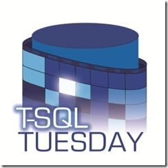

Write-Output "What are you going to automate today?"

 

Welcome to T-SQL Tuesday for September 2017!

[T-SQL Tuesday](http://tsqltuesday.com/) is a chance for you to join in the SQL Server community and write a blog post on a suggested topic. It makes for a great way to find a bunch of blog posts showing the same subject from many different viewpoints. Please join in and write a blog post, maybe it's your first ever, maybe you haven't blogged for a while but even if you blog every day come and join the party and share your knowledge.

To participate:

1. Write a post on the topic below
2. Schedule the post to go live on Tuesday, September 12th (between zero am and midnight, UTC)
3. Include the [TSQL Tuesday logo](http://sqlblog.com/blogs/adam_machanic/archive/2010/06/01/t-sql-tuesday-007-and-t-sql-tuesday-has-a-logo.aspx) in the top of your post
4. Link the post back to this one (it’s easier if you comment on this post and link it)
5. Optional: Tweet a link to your post using the [#tsql2sday hash tag on Twitter](https://twitter.com/hashtag/TSQL2sday?src=hash)

Extra credit: if you’d like to host your own TSQL Tuesday in the future, [read the full rules for info on how to sign up](http://sqlblog.com/blogs/adam_machanic/archive/2017/01/03/t-sql-tuesday-rules-of-engagement.aspx). Just like I did but don't forget its your month!!

## This month’s topic: Let's get all Posh - What are you going to automate today?

It is no surprise to those that know me that I will choose PowerShell as the topic for this month. I am passionate about PowerShell because it has enabled me to have the career I have today and to visit numerous countries all around the world, meet people and talk about PowerShell. By my reckoning [searching the TSQL Tuesday website](http://tsqltuesday.com/?s=PowerShell) it has been over 3 years since we had a topic specific to PowerShell. So I would like you to blog about PowerShell and SQL Server (or other interesting data platform products)

If you don't know or use PowerShell GREAT! That's awesome.

Please spend an hour or so with it and tell us how you got on and what and how you learned. Just like [Erik and Brent did](https://www.brentozar.com/archive/2017/07/live-blogging-erik-vs-PowerShell/). You could install one of the community modules like [dbatools](https://dbatools.io), [dbareports](https://dbareports.io) , [SQLDiagAPI](https://www.PowerShellgallery.com/packages/SQLDiagAPI)  or the Microsoft ones [sqlserver](https://www.PowerShellgallery.com/packages/Sqlserver) or [SSRS](https://github.com/Microsoft/ReportingServicesTools) and try them out and tell us what you learned.

If you want help whilst doing this please make use of the #PowerShellhelp channel in the [SQL Server Community Slack](https://sqlps.io/slack)

This will be of so much benefit to all people who don't use PowerShell and want to start to learn about it.

If you do use PowerShell and SQL then either tell the tale of the best thing you have automated or a beginners post to show people how to start using PowerShell. I have heard many stories and am looking forward to tales of

- testing backups
- doing migrations
- resetting log shipping
- creating things in the cloud and on premises
- SQL on Linux with PowerShell on Linux
- using Pester for testing
- automating manual tasks
- automating incident knowledge gathering
- continuous integration and delivery

and many more. I will read all of them and do a write up of them later next week.

Invoke-Coffee

Start-BlogWriting -Title 'Cool PowerShell Post'

Get-BlogProofRead

Post-Blog -Date ‘September 12th 2017’ -Title 'Cool PowerShell Post'

Write-Tweet -Hashtag ‘TSQL2sday’ -Message 'This is my cool blogpost'

 

