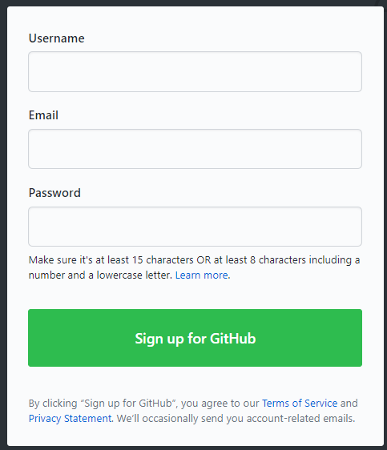
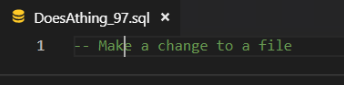
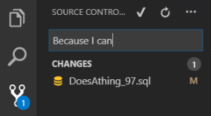
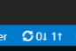
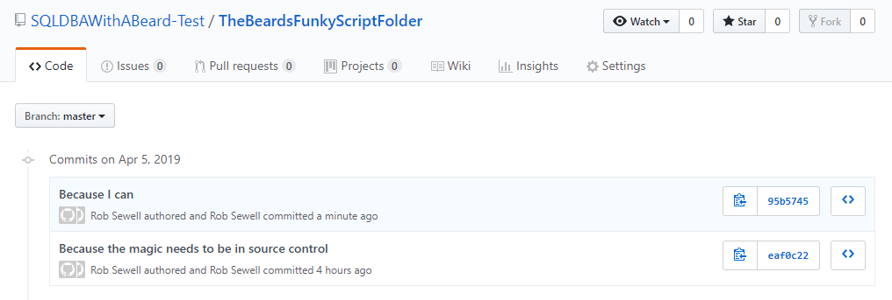

Yesterday there was a tweet from Allen White.

https://twitter.com/SQLRunr/status/1113862196201758720

Allen wanted to add his scripts folder to source control but didn't have a how to do it handy. So I thought I would write one. Hopefully this will enable someone new to GitHub and to source control get a folder of scripts under source control

## GitHub account

If you do not have a GitHub account go to [https://github.com](https://github.com) and create a new account

[](https://sqldbawithabeard.com/wp-content/uploads/2019/04/image.png)

There is a funky are you a human challenge

[](https://sqldbawithabeard.com/wp-content/uploads/2019/04/image-1.png)

Then you can choose your subscription

[](https://sqldbawithabeard.com/wp-content/uploads/2019/04/image-2.png)

Then answer some questions (Note - you probably want to choose different answers to the what are you interested in question! I'd suggest something technical)

[](https://sqldbawithabeard.com/wp-content/uploads/2019/04/image-3.png)

You need to do the email verification

[](https://sqldbawithabeard.com/wp-content/uploads/2019/04/image-4.png)

Next is a very important step - Please do not skip this. You should set up 2 factor authentication. Yes even if "It's just for me there is nothing special here"

Click your user icon top right and then settings

[](https://sqldbawithabeard.com/wp-content/uploads/2019/04/image-5.png)

Then click set up two factor authentication

[](https://sqldbawithabeard.com/wp-content/uploads/2019/04/image-6.png)

and either set up with an app or via SMS (I suggest the app is better)

OK - Now you have your GitHub account set up. It should have taken you less time than reading this far.

## Add a Scripts Folder to GitHub

OK, Now to add a folder of scripts to a repository. Here is my folder of scripts. They can be any type of files. I would recommend copy the folder to a specific Git folder.

[](https://sqldbawithabeard.com/wp-content/uploads/2019/04/image-7.png)

Open VS Code - If you don't have VS Code, download it from
[https://code.visualstudio.com/](https://code.visualstudio.com/) From the welcome window choose open folder

[](https://sqldbawithabeard.com/wp-content/uploads/2019/04/image-8.png)


and open your scripts folder

[](https://sqldbawithabeard.com/wp-content/uploads/2019/04/image-9.png)

In VS Code click the Source Control button

[](https://sqldbawithabeard.com/wp-content/uploads/2019/04/image-10.png)


and up at the top you will see a little icon - initialise repository

[](https://sqldbawithabeard.com/wp-content/uploads/2019/04/image-11.png)


Click that and choose your folder

[](https://sqldbawithabeard.com/wp-content/uploads/2019/04/image-12.png)

Which will then show all of the changes to the repository (adding all the new files)

[](https://sqldbawithabeard.com/wp-content/uploads/2019/04/image-13.png)

Now we need to add a commit message for our changes. I generally try to write commit messages that are the reason why the change has been made as the what has been changed is made easy to see in VS Code (as well as other source control GUI tools)

[](https://sqldbawithabeard.com/wp-content/uploads/2019/04/image-14.png)

Click the tick or press CTRL + ENTER and this box will pop up

[](https://sqldbawithabeard.com/wp-content/uploads/2019/04/image-15.png)


I never click Always, I click yes, so that I can check if I am committing the correct files. Now we have created a local repository for our scripts folder. Our next step is to publish it to GitHub

## Create a New Repository in GitHub

In GitHub we need to create a remote repository. Click on the New Button. Give your repository a name and decide if you want it to be Public (available for anyone to search and find) or Private (only available to people you explicitly provide access to).

[](https://sqldbawithabeard.com/wp-content/uploads/2019/04/image-18.png)

This will give you a page that looks like this

[](https://sqldbawithabeard.com/wp-content/uploads/2019/04/image-19.png)

Copy the code after …or push an existing repository from the command line

```
# make sure prompt is at right place
Set-Location C:\Git\MyScriptsFolder
# Then paste the code
git remote add origin https://github.com/SQLDBAWithABeard-Test/TheBeardsFunkyScriptFolder.git
git push -u origin master
```

and paste it into PowerShell in VS Code. Make sure that your prompt is at the root of your scripts folder.

[](https://sqldbawithabeard.com/wp-content/uploads/2019/04/image-20.png)

Fill in your username and password and your 2FA

Then you will see a page like this

[](https://sqldbawithabeard.com/wp-content/uploads/2019/04/image-21.png)

and if you refresh your GitHub page you will see

[](https://sqldbawithabeard.com/wp-content/uploads/2019/04/image-22.png)

Congratulations, your code is source controlled :-)

## Making Changes

Now you can make a change to a file

[](https://sqldbawithabeard.com/wp-content/uploads/2019/04/image-23.png)

Commit your change

[](https://sqldbawithabeard.com/wp-content/uploads/2019/04/image-24.png)

Hit the roundy-roundy icon (anyone know its proper name ?)

[](https://sqldbawithabeard.com/wp-content/uploads/2019/04/image-25.png)

Press OK and your commit will be pushed to GitHub :-)

[](https://sqldbawithabeard.com/wp-content/uploads/2019/04/image-26.png)

Yay - Source Control all the things


