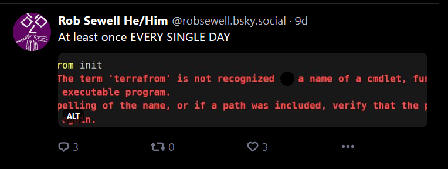

# So that I will remember!

It took me too long to find this. The google-fu was failing. How to download terraform providers. How can I download terraform providers. Downloading terraform providers. Getting terraform providers locally. I even checked for my favourite misspelling!

[](../assets/uploads/2023/terraform.png)

but actually the answer to downloading the terraform providers locally for the mirror is in the documentation https://developer.hashicorp.com/terraform/cli/commands/providers/mirror

>The ```terraform providers mirror``` command downloads the providers required for the current configuration and copies them into a directory in the local filesystem.

```
terraform providers mirror /tmp
```

Simples