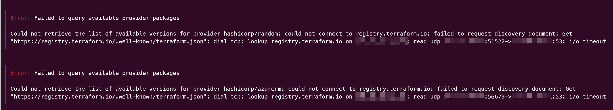
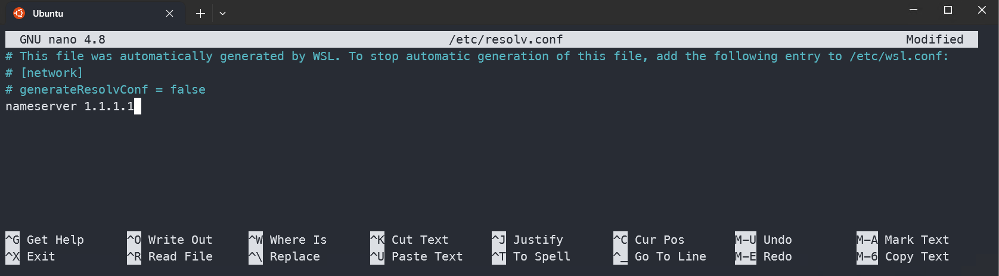

# So that I will remember!

When running WSL in a corporate environment, I sometimes an error like the following, where the cli is not able to resolve the IP address correctly. This error is from terraform but I have seen it elsewhere.

[](../../assets/uploads/2023/wsl-dns-fail.png)
> ╷
│ Error: Failed to query available provider packages
│
│ Could not retrieve the list of available versions for provider hashicorp/random: could not connect to registry.terraform.io: failed to request discovery document: Get
│ "https://registry.terraform.io/.well-known/terraform.json": dial tcp: lookup registry.terraform.io on 123.45.67.89:53: read udp 123.45.67.89:51522->123.45.67.89:53: i/o timeout

to fix it

# Change the DNS Server in /etc/resolv.conf

```
sudo nano /etc/resolv.conf
```
[](../../assets/uploads/2023/wsl-dns-resolv.png)
I normally just change the nameserver to 1.1.1.1

You will need to do this for every tab you open or you can follow the instructions to set it permanently

```
# This file was automatically generated by WSL. To stop automatic generation of this file, add the following entry to /etc/wsl.conf:
# [network]
# generateResolvConf = false
```
Now I know :-)