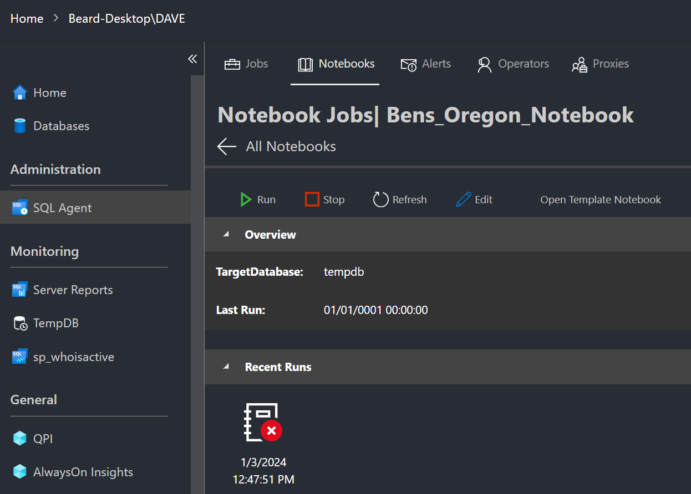
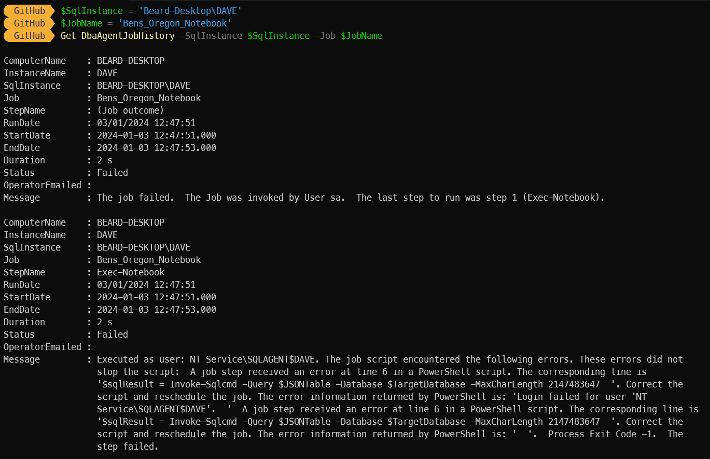
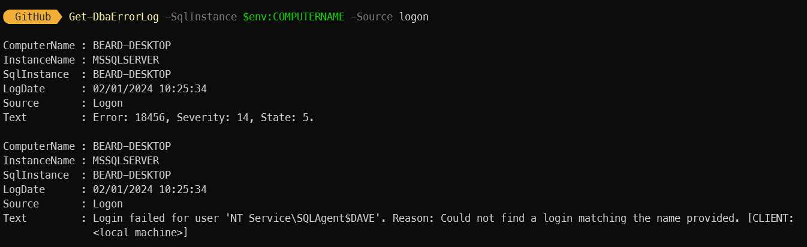
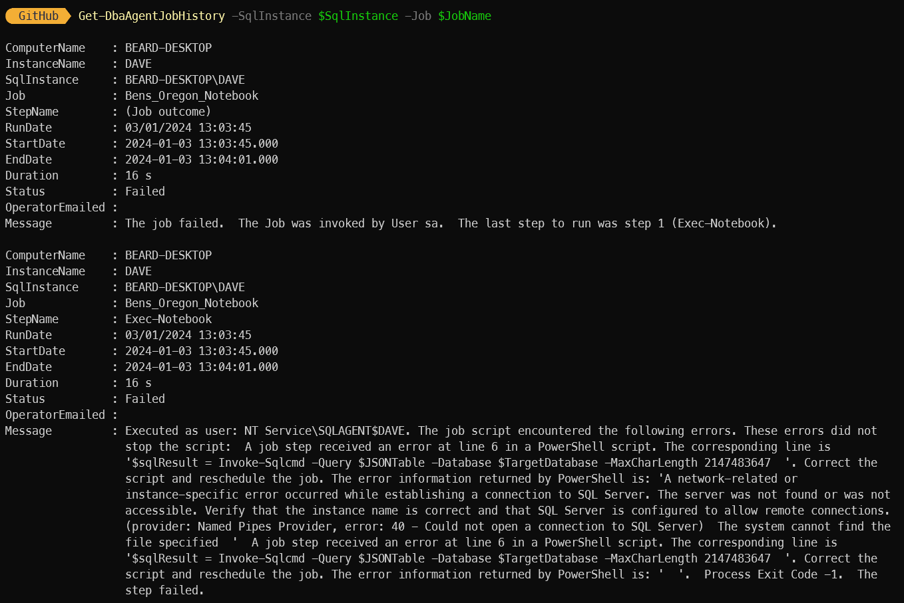
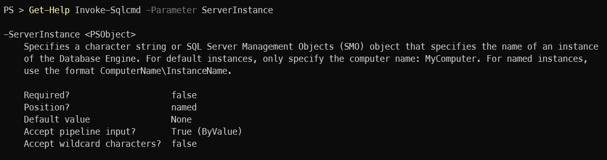
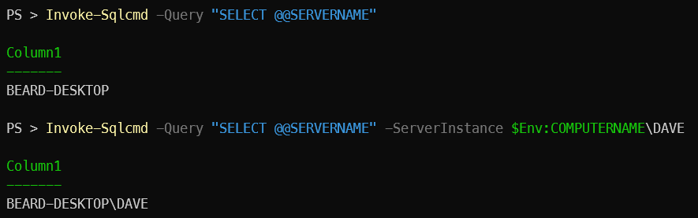

## Can you help? Erland said

The first I realised about this problem was when Erland Sommarskog [b](https://www.sommarskog.se/) asked me if I could help with [this forum post](https://learn.microsoft.com/en-us/answers/questions/1465685/scheduling-python-notebook-using-sql-server-agent?wt.mc_id=dp-mvp-5002693) The poster was getting an error when trying to run a Notebook Agent Job. The error was a very generic instance not found error

> A network-related or instance-specific error occurred while establishing a connection to SQL Server. The server was not found or was not accessible. Verify that the instance name is correct and that SQL Server is configured to allow remote connections. (provider: Named Pipes Provider<c/> error: 40 - Could not open a connection to SQL Server) The system cannot find the file specified  

## Reproduce the issue

How very odd I thought. I noticed that it was a named instance, so I tried to recreate the issue on my own named instance DAVE. [I added a new notebook job](https://blog.robsewell.com/blog/running-jupyter-notebooks-as-agent-jobs/) and when I tried to run it. It failed

[](../assets/uploads/2024/newjob.png)

### Huh ?

Hmm. But I got a different error.

[](../assets/uploads/2024/joberror.png)

>'Login failed for user 'NT Service\SQLAGENT$DAVE'

That doesn't make a lot of sense. Why is the login failing?

### Where is the logon ?

I checked the error log using

`Get-DbaErrorLog -SqlInstance $SqlInstance -Source logon`

but there were no results.

Wait a minute.

## Bingo

I have the default instance running on this machine. Lets check the error log on that instance as well.

`Get-DbaErrorLog -SqlInstance $ENV:COMPUTERNAME -Source logon`

[](../assets/uploads/2024/logonfailed.png)

> Login failed for user 'NT Service\SQLAgent$DAVE'. Reason: Could not find a login matching the name provided. [CLIENT: <local machine>]  

So the Agent service for the named instance is failing to logon to the default instance on the host.  

## Let's recreate the error properly this time

Stop the default instance

`Stop-Service MSSQLSERVER -Force`

and rerun the job, which fails, and get the error message

`Get-DbaAgentJobHistory -SqlInstance $SqlInstance -Job $JobName`

[](../assets/uploads/2024/noinstance.png)

So I have recreated the error.

## Now to solve it

First we need to understand what is happening. If we look at the Job Step for the Agent Job in Azure Data Studio

 

There is some PowerShell running to execute the cells of the notebook and gather the results and place them in the database for later use.

The code uses `$(ESCAPE_SQUOTE(A THING))` which is passing the Agent Job tokens to the script. [you can find the list of Agent Job tokens here](https://learn.microsoft.com/en-us/sql/ssms/agent/use-tokens-in-job-steps?view=sql-server-ver16&WT.mc_id=DP-MVP-5002693#sql-server-agent-tokens)

Then it calls `Invoke-SqlCmd` without a `ServerInstance` parameter. If you look at the documentation for the parameter [web](https://learn.microsoft.com/en-us/powershell/module/sqlserver/invoke-sqlcmd?view=sqlserver-ps&WT.mc_id=DP-MVP-5002693#-serverinstance)

[](../assets/uploads/2024/serverinstancehelp.png)

it shows the Default Value as `None` but this does not explain what it does. With no value set for the `ServerInstance` parameter, `Invoke-SqlCmd` will try to connect to the default instance as we can see below.

[](../assets/uploads/2024/instanceconnect.png)

## Solution

So we can get the Agent Job Tokens for the host and the instance name and set them as a variable and pass them to the ServerInstance paramater every time that it is called.

```PowerShell
$SqlInstance = '{0}\{1}' -f "$(ESCAPE_SQUOTE(MACH))", "$(ESCAPE_SQUOTE(INST))"
```  

## Better Solution

To save a load of copy pasta, the risk of not identifying all of the calls to the cmdlet, and keep the exising coding standards we can instead use [PsDefaultParameters](https://learn.microsoft.com/en-us/powershell/module/microsoft.powershell.core/about/about_parameters_default_values?view=powershell-7.4&WT.mc_id=DP-MVP-5002693)

```
$SqlInstance = '{0}\{1}' -f "$(ESCAPE_SQUOTE(MACH))", "$(ESCAPE_SQUOTE(INST))"

$PSDefaultParameterValues = @{
     "Invoke-SqlCmd:ServerInstance" = $SqlInstance 
}
```  

### What is this doing?

It is creating a variable named `SqlInstance` that is made up of the SQL Agent Job Tokens for the machine and the instance name

Then it is setting that variable as the default value for the `ServerInstance` paramater of the `Invoke-SqlCmd` cmdlet for this session only

This means that all of the times that the `Invoke-SqlCmd` cmdlet is called it will use the correct value whether it is on a default or a named instance.

## Most best solution

As this code is [available on GitHub](https://github.com/microsoft/sqltoolsservice) and anyone can create an issue or a Pull Request, I did just that :-)  

Issue - https://github.com/microsoft/sqltoolsservice/issues/2305  
Pull request - https://github.com/microsoft/sqltoolsservice/pull/2306 
