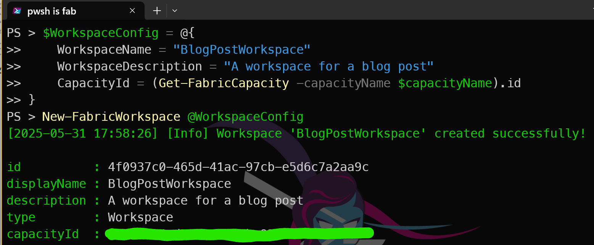
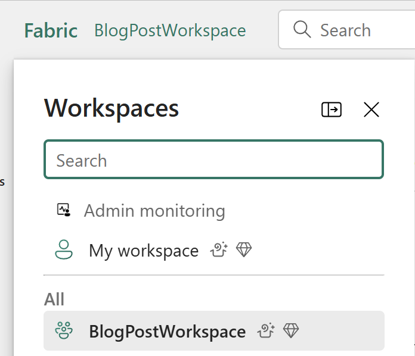
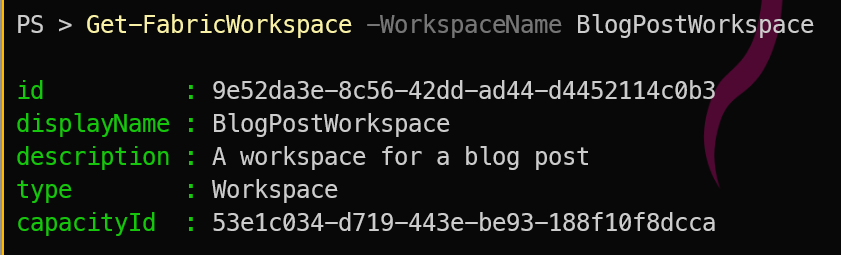

## Introduction

Microsoft Fabric is a low friction unified analytics platform that brings together data engineering, data integration, data warehousing, data science, real-time analytics, and business intelligence.

# Fabric Workspace
A [Fabric workspace](https://learn.microsoft.com/en-us/fabric/fundamentals/workspaces?WT.mc_id=DP-MVP-5002693) is a container for all your Fabric assets, such as datasets, dataflows, notebooks, and reports. It allows you to organize and manage your Fabric resources effectively.

# How do you create a Fabric Workspace?

There are several ways to create a [Fabric workspace](https://learn.microsoft.com/en-us/fabric/fundamentals/workspaces?WT.mc_id=DP-MVP-5002693), including using the Fabric portal, [Fabric CLI](https://learn.microsoft.com/en-us/rest/api/fabric/articles/fabric-command-line-interface?WT.mc_id=DP-MVP-5002693), using the [Fabric Terraform provider](https://registry.terraform.io/providers/microsoft/fabric/latest/docs)

# What is FabricTools?

We are going to use [FabricTools](https://github.com/dataplat/FabricTools?WT.mc_id=DP-MVP-5002693), a PowerShell module that simplifies the management of Microsoft Fabric resources. [FabricTools](https://github.com/dataplat/FabricTools?WT.mc_id=DP-MVP-5002693) provides cmdlets to create, update, and delete Fabric workspaces and other resources. It has been developed by the community, particularly

[Ioana Bouariu](https://github.com/Jojobit?WT.mc_id=DP-MVP-5002693)
[Frank Geisler](https://github.com/Frank-Geisler?WT.mc_id=DP-MVP-5002693)
[Tiago Balabuch](https://github.com/tiagobalabuch?WT.mc_id=DP-MVP-5002693)

It is available on [GitHub](https://github.com/dataplat/FabricTools?WT.mc_id=DP-MVP-5002693).

# How do you install FabricTools?

To install the [FabricTools](https://www.powershellgallery.com/packages/FabricTools?WT.mc_id=DP-MVP-5002693) module from the PowerShell Gallery:

```powershell
Install-PsResource -Name FabricTools
```

# Create a Fabric Workspace with PowerShell

First you need to connect to your Fabric account using the `Connect-FabricAccount` cmdlet. This cmdlet will prompt you to sign in with your Microsoft account. I like to use a secret to store my tenant ID, so I can use it in my scripts without hardcoding it. You can use the `Get-Secret` cmdlet from the [Microsoft.PowerShell.SecretManagement](https://learn.microsoft.com/en-us/powershell/module/microsoft.powershell.secretmanagement/?WT.mc_id=DP-MVP-5002693) module to retrieve the secret.

```powershell
Connect-fabricAccount -TenantId (Get-Secret -Name beard-mvp-tenant-id -AsPlainText)
```

Next, you can create a Fabric workspace using the `New-FabricWorkspace` cmdlet. You need to specify the name of the workspace, the capacity id that it will be assigned to, and optionally a description.

```powershell
$WorkspaceConfig = @{
    WorkspaceName = "BlogPostWorkspace"
    WorkspaceDescription = "A workspace for a blog post"
    CapacityId = (Get-FabricCapacity -capacityName $capacityName).id
}
New-FabricWorkspace @WorkspaceConfig
```
[](../assets/uploads/2025/new-fabricwarehouse.png)

and bingo! You have created a Fabric workspace using PowerShell. You can now use this workspace to create and manage your Fabric assets. You can see it in the Fabric portal under the Workspaces section.

[](../assets/uploads/2025/worksapcelist.png)

and you can also use the `Get-FabricWorkspace` cmdlet to retrieve the details of the workspace you just created.

```powershell
Get-FabricWorkspace -WorkspaceName BlogPostWorkspace
```
This will return the details of the workspace, including its ID, name, description, and capacity ID.
[](../assets/uploads/2025/getfabricworksapce.png)

# Conclusion
A beginner-friendly guide to creating a Microsoft Fabric workspace using PowerShell. This method is particularly useful for automating the creation of workspaces in a consistent and repeatable manner using PowerShell.

