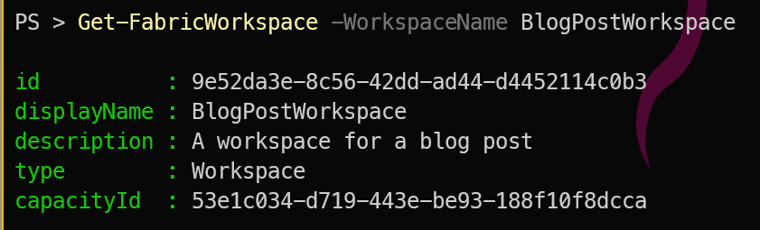

## Introduction

Yesterday we showed how to [create a Microsoft Fabric workspace using PowerShell](https://blog.robsewell.com/blog/create-a-microsoft-fabric-workspace-with-powershell/). Today, we will add users to that workspace using the [FabricTools](https://github.com/dataplat/FabricTools?WT.mc_id=DP-MVP-5002693) module.

## Getting the Workspace

Lets see how to get the workspace we created yesterday. We will use the `Get-FabricWorkspace` cmdlet to retrieve the workspace details.

```powershell
Get-FabricWorkspace -WorkspaceName BlogPostWorkspace
```
[](../assets/uploads/2025/getfabricworksapce.png)

## Adding Users to the Workspace
You can add users to the workspace using the `Add-FabricWorkspaceRoleAssignment` function. This function allows you to specify the group and the role you want to assign them.

```powershell
$AssignSQLAdmins = @{
    WorkspaceId   = (Get-FabricWorkspace -WorkspaceName BlogPostWorkspace).id
    WorkspaceRole = "Viewer"
    PrincipalId   = "f1f0057c-53d4-4a73-961a-c3f4501cbce1"
    PrincipalType = "Group"
}

Add-FabricWorkspaceRoleAssignment @AssignSQLAdmins
```
If you wish to add a user instead of a group, you can change the `PrincipalType` to `User` and provide the user's Object ID.

```powershell
$AssignJPAdmin = @{
    WorkspaceId   = (Get-FabricWorkspace -WorkspaceName BlogPostWorkspace).id
    WorkspaceRole = "Admin"
    PrincipalId   = "51c232a0-908b-4192-a375-c20407c72970"
    PrincipalType = "User"
}
Add-FabricWorkspaceRoleAssignment @AssignJPAdmin
```

[](../assets/uploads/2025/workspaceusers.png)

# Viewing the Users Roles in the Workspace
You can view the users and their roles in the workspace using the `Get-FabricWorkspaceRoleAssignment` cmdlet.

```powershell
Get-FabricWorkspaceRoleAssignment -WorkspaceId (Get-FabricWorkspace -WorkspaceName BlogPostWorkspace).id
```
[](../assets/uploads/2025/getfabricroles.png)

## Conclusion
In this post, we learned how to add users to a Microsoft Fabric workspace using PowerShell. We used the `Add-FabricWorkspaceRoleAssignment` cmdlet to assign roles to users and groups. This allows for easy management of user access within your Fabric workspace.