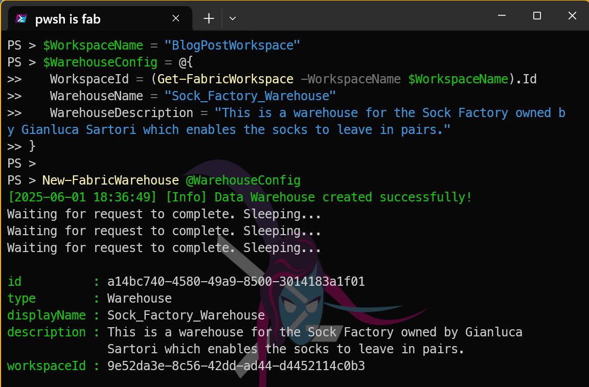
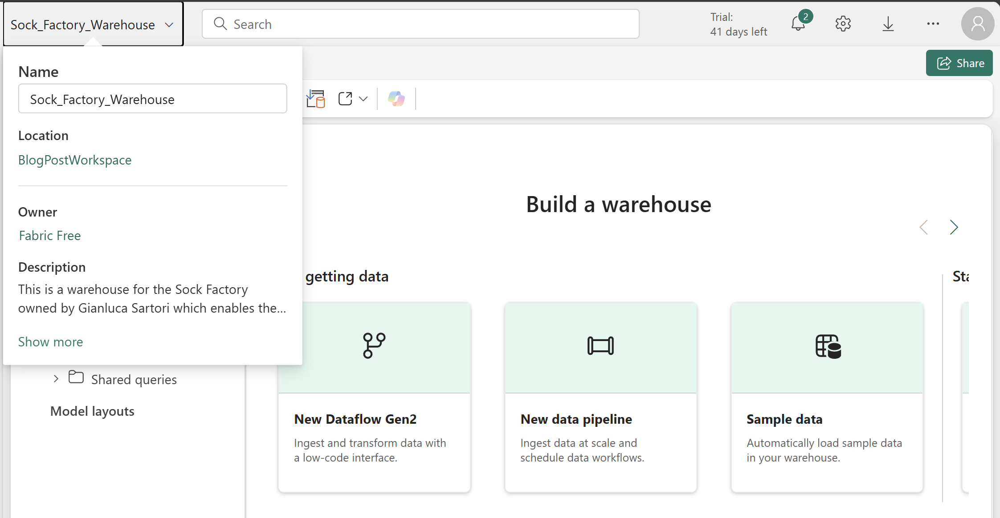

## Introduction

Microsoft Fabric is a low friction unified analytics platform that brings together data engineering, data integration, data warehousing, data science, real-time analytics, and business intelligence.

# Fabric Warehouse
A [Fabric warehouse](https://learn.microsoft.com/en-us/fabric/data-warehouse/data-warehousing?WT.mc_id=DP-MVP-5002693)is a next-generation data warehousing solution.

It is designed to handle large volumes of data and provide fast query performance.

# How do you create a Fabric Warehouse?

There are several ways to create a [Fabric warehouse](https://learn.microsoft.com/en-us/fabric/data-warehouse/data-warehousing?WT.mc_id=DP-MVP-5002693), including using the Fabric portal, [Fabric CLI](https://learn.microsoft.com/en-us/rest/api/fabric/articles/fabric-command-line-interface?WT.mc_id=DP-MVP-5002693), using the [Fabric Terraform provider](https://registry.terraform.io/providers/microsoft/fabric/latest/docs).

# What is FabricTools?
We are going to use [[FabricTools](https://www.powershellgallery.com/packages/FabricTools?WT.mc_id=DP-MVP-5002693), a PowerShell module that simplifies the management of Microsoft Fabric resources. You can find it on GitHub at[[FabricTools](https://github.com/dataplat/FabricTools?WT.mc_id=DP-MVP-5002693) provides functions to create, update, and delete Fabric warehouses and other resources. It has been developed and is maintained by members of the community.

# How do you install FabricTools?
To install the [FabricTools](https://www.powershellgallery.com/packages/FabricTools?WT.mc_id=DP-MVP-5002693) module from the PowerShell Gallery:

```powershell
Install-PsResource -Name FabricTools
```
# Create a Fabric Warehouse with PowerShell
First, you need to connect to your Fabric account using the `Connect-FabricAccount` cmdlet. This cmdlet will prompt you to sign in with your Microsoft account. I like to use a secret to store my tenant ID, so I can use it in my scripts without hardcoding it. You can use the `Get-Secret` cmdlet from the [Microsoft.PowerShell.SecretManagement](https://learn.microsoft.com/en-us/powershell/module/microsoft.powershell.secretmanagement/?WT.mc_id=DP-MVP-5002693) module to retrieve the secret.

```powershell
Connect-fabricAccount -TenantId (Get-Secret -Name beard-mvp-tenant-id -AsPlainText)
```
Next, you can create a Fabric warehouse using the `New-FabricWarehouse` cmdlet. You need to specify the name of the warehouse, the workspace id that it will be assigned to, and optionally a description.

```powershell
$WorkspaceName = "BlogPostWorkspace"
$WarehouseConfig = @{
   WorkspaceId = (Get-FabricWorkspace -WorkspaceName $WorkspaceName).Id
   WarehouseName = "Sock_Factory_Warehouse"
   WarehouseDescription = "This is a warehouse for the Sock Factory owned by Gianluca Sartori which enables the socks to leave in pairs."
}

New-FabricWarehouse @WarehouseConfig
```
This will create a new Fabric warehouse with the specified name and description in the specified workspace.

[](../assets/uploads/2025/06/newfabricwarehouse-pwsh.png)

You can also see it in the Fabric portal in the workspace you specified.

[](../assets/uploads/2025/06/newfabricwarehouse-portal.png)

You can also verify that the warehouse has been created by using the `Get-FabricWarehouse` function. This will also return the details of the SQL connection string that you can use to connect to the warehouse from other applications like [SQL Server Management Studio](https://learn.microsoft.com/en-us/ssms/?WT.mc_id=DP-MVP-5002693) [Visual Studio Code](https://code.visualstudio.com/?WT.mc_id=DP-MVP-5002693).

```powershell
Get-FabricWarehouse -WorkspaceName $WorkspaceName
```
[](../assets/uploads/2025/06/fabric-warehouse.png)

## Conclusion
In this post, we learned how to create a Microsoft Fabric warehouse using PowerShell. We used the `New-FabricWarehouse` cmdlet to create a warehouse in a specified workspace. This allows you to manage your data warehousing needs effectively within the Microsoft Fabric platform.
You can now use this warehouse to store and analyze your data using the powerful features of Microsoft Fabric.