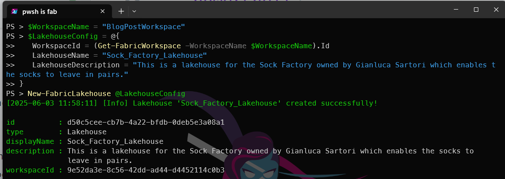
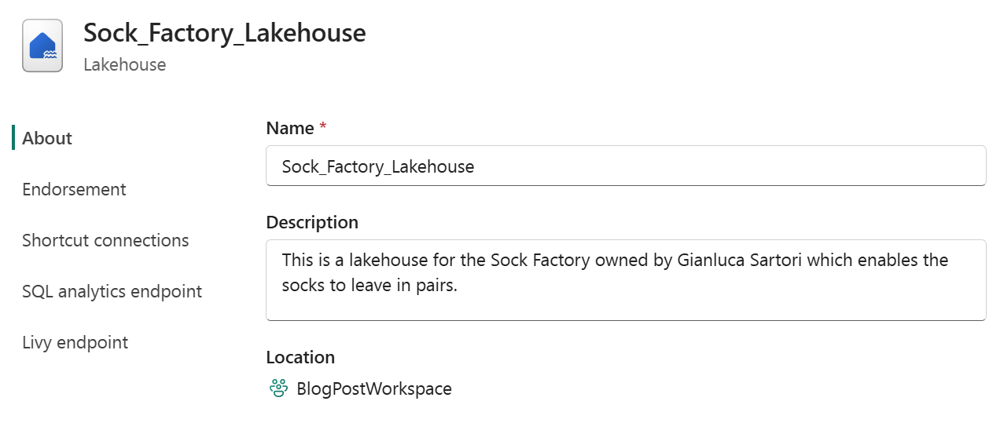
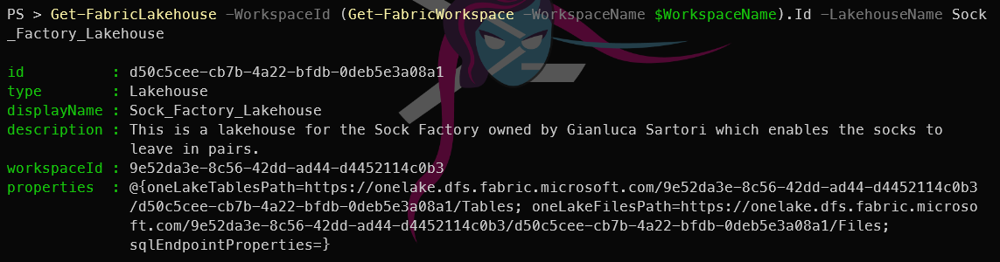

## Introduction

Having created a [Microsoft Fabric workspace using PowerShell](https://blog.robsewell.com/blog/create-a-microsoft-fabric-workspace-with-powershell/), [assigned users to it using PowerShell](https://blog.robsewell.com/blog/add-users-to-a-microsoft-fabric-workspace-with-powershell/), and created a [Microsoft Fabric Warehouse using PowerShell](https://blog.robsewell.com/blog/create-a-microsoft-fabric-warehouse-with-powershell/), we now turn our attention to creating a Microsoft Fabric Lakehouse using PowerShell. These posts all look remarkably similar :-) and thats because the functionality they are showing is exactly same..

Just like [dbatools](dbatools.io) and [dbachecks](https://github.com/dataplat/dbachecks/) creating functions that follow the same pattern makes it easier to learn. This is why FabricTools has chosen to use the same pattern for creating Fabric resources using PowerShell.

## Fabric Lakehouse
A [Fabric Lakehouse](https://learn.microsoft.com/en-us/fabric/data-engineering/lakehouse-overview?WT.mc_id=DP-MVP-5002693) combines the scalability of a data lake with the performance and structure of a data warehouse, providing a unified platform for data storage, management, and analytics.. It allows you to store structured and unstructured data in a single location, making it easier to analyze and visualize your data.

## How do you create a Fabric Lakehouse?

There are several ways to create a [Fabric Lakehouse](https://learn.microsoft.com/en-us/fabric/data-engineering/lakehouse-overview?WT.mc_id=DP-MVP-5002693), including using the Fabric portal, [Fabric CLI](https://learn.microsoft.com/en-us/rest/api/fabric/articles/fabric-command-line-interface?WT.mc_id=DP-MVP-5002693), using the [Fabric Terraform provider](https://registry.terraform.io/providers/microsoft/fabric/latest/docs).
## What is FabricTools?
We are going to use [[FabricTools](https://www.powershellgallery.com/packages/FabricTools?WT.mc_id=DP-MVP-5002693), a PowerShell module that simplifies the management of Microsoft Fabric resources. You can find it on GitHub at [FabricTools](https://github.com/dataplat/FabricTools?WT.mc_id=DP-MVP-5002693). FabricTools provides functions to create, update, and delete Fabric Lakehouses and other resources. It has been developed and is maintained by members of the community.

## How do you create a Fabric Lakehouse with PowerShell?
To create a Fabric Lakehouse with PowerShell, you first need to connect to your Fabric account using the `Connect-FabricAccount` cmdlet. This cmdlet will prompt you to sign in with your Microsoft account. I like to use a secret to store my tenant ID, so I can use it in my scripts without hardcoding it. You can use the `Get-Secret` cmdlet from the [Microsoft.PowerShell.SecretManagement](https://learn.microsoft.com/en-us/powershell/module/microsoft.powershell.secretmanagement/?WT.mc_id=DP-MVP-5002693) module to retrieve the secret.

```powershell
Connect-fabricAccount -TenantId (Get-Secret -Name beard-mvp-tenant-id -AsPlainText)
```
Next, you can create a Fabric Lakehouse using the `New-FabricLakehouse` cmdlet. You need to specify the name of the Lakehouse, the workspace id that it will be assigned to, and optionally a description.

```powershell
$WorkspaceName = "BlogPostWorkspace"
$LakehouseConfig = @{
   WorkspaceId = (Get-FabricWorkspace -WorkspaceName $WorkspaceName).Id
   LakehouseName = "Sock_Factory_Lakehouse"
   LakehouseDescription = "This is a lakehouse for the Sock Factory owned by Gianluca Sartori which enables the socks to leave in pairs."
}
New-FabricLakehouse @LakehouseConfig
```
This will create a new Fabric Lakehouse with the specified name and description in the specified workspace.

[](../assets/uploads/2025/06/newfabriclakehouse-pwsh.png)

You can also see it in the Fabric portal in the workspace you specified.
[](../assets/uploads/2025/06/newfabriclakehouse-portal.png)

You can also view the Lakehouse details using the `Get-FabricLakehouse` cmdlet.

```powershell
Get-FabricLakehouse -WorkspaceId (Get-FabricWorkspace -WorkspaceName $WorkspaceName).Id -LakehouseName Sock_Factory_Lakehouse
```
[](../assets/uploads/2025/06/getfabriclakehouse.png)

which will return the details of the Lakehouse connection properties as well as its ID, name, description, and workspace ID.

## Conclusion
In this blog post, we have shown how to create a Microsoft Fabric Lakehouse using PowerShell. We used the `New-FabricLakehouse` cmdlet from the [FabricTools](https://www.powershellgallery.com/packages/FabricTools?WT.mc_id=DP-MVP-5002693) module to create a Lakehouse in a specified Fabric workspace. This allows you to easily manage your Fabric Lakehouses using PowerShell, making it a powerful tool for automating your data engineering tasks.
