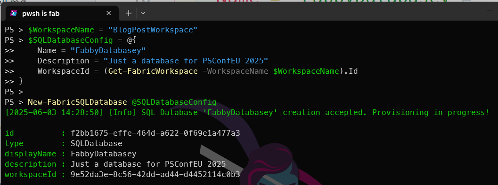
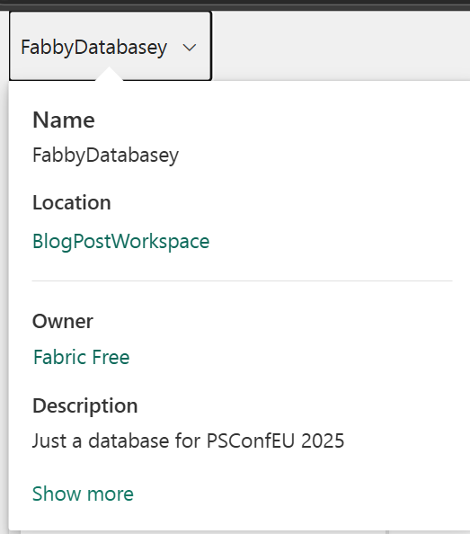
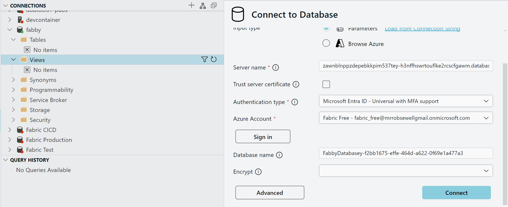

## Introduction

Having created a [workspace, a lakehouse, a warehouse previously](https://blog.robsewell.com/categories/microsoft-fabric/) we now turn our attention to creating a Fabric SQL Database using PowerShell. These posts so far all look remarkably similar and thats because the functionality they are showing is pretty much the same, just with different resources.

Just like [dbatools](dbatools.io) and [dbachecks](https://github.com/dataplat/dbachecks/) creating functions that follow the same pattern makes it easier to learn and use the tools. This is why FabricTools has chosen to use the same pattern for creating Fabric resources using PowerShell.

## Fabric SQL Database

A [Fabric SQL Database](https://learn.microsoft.com/en-us/fabric/database/sql/overview?WT.mc_id=DP-MVP-5002693) is a SQL Database that is hosted in Microsoft Fabric. It provides a fully managed SQL database service that allows you to store and query your data using SQL using the same SLQ Engine as Azure SQL Database.

## What is FabricTools?
We are going to use [[FabricTools](https://www.powershellgallery.com/packages/FabricTools?WT.mc_id=DP-MVP-5002693), a PowerShell module that simplifies the management of Microsoft Fabric resources. You can find it on GitHub at [FabricTools](https://github.com/dataplat/FabricTools?WT.mc_id=DP-MVP-5002693). FabricTools provides functions to create, update, and delete Fabric Lakehouses and other resources. It has been developed and is maintained by members of the community.

## How do you create a Fabric SQL Database with PowerShell?
To create a Fabric SQL Database with PowerShell, you first need to connect to your Fabric account using the `Connect-FabricAccount` cmdlet. This cmdlet will prompt you to sign in with your Microsoft account. I like to use a secret to store my tenant ID, so I can use it in my scripts without hardcoding it. You can use the `Get-Secret` cmdlet from the [Microsoft.PowerShell.SecretManagement](https://learn.microsoft.com/en-us/powershell/module/microsoft.powershell.secretmanagement/?WT.mc_id=DP-MVP-5002693) module to retrieve the secret.

```powershell
Connect-fabricAccount -TenantId (Get-Secret -Name beard-mvp-tenant-id -AsPlainText)
```

Next, you can create a Fabric SQL Database using the `New-FabricSqlDatabase` cmdlet. You need to specify the name of the database, the workspace id that it will be assigned to, and optionally a description.

```powershell
$WorkspaceName = "BlogPostWorkspace"
$SQLDatabaseConfig = @{
    Name = "FabbyDatabasey"
    Description = "Just a database for PSConfEU 2025"
    WorkspaceId = (Get-FabricWorkspace -WorkspaceName $WorkspaceName).Id
}

New-FabricSQLDatabase @SQLDatabaseConfig
```
This will create a new Fabric SQL Database with the specified name and description in the specified workspace.

[](../assets/uploads/2025/06/newfabricdatabase-pwsh.png)

You can also see it in the Fabric portal in the workspace you specified.
[](../assets/uploads/2025/06/newfabricdatabase-portal.png)

You can also view the SQL Database details using the `Get-FabricSQLDatabase` cmdlet.

```powershell
Get-FabricSQLDatabase -WorkspaceId (Get-FabricWorkspace -WorkspaceName $WorkspaceName).Id -DatabaseName FabbyDatabasey
```
[](../assets/uploads/2025/06/getfabricdatabase.png)

this will also show you the details of the SQL Database, including its name, description,connection details and workspace ID.

You can use this information to connect to the SQL Database in Visual Studio Code or SSMS.

[](../assets/uploads/2025/06/connection.png)

## Conclusion
In this blog post, we have shown how to create a Fabric SQL Database using PowerShell. We have used the `New-FabricSQLDatabase` cmdlet from the [FabricTools](https://www.powershellgallery.com/packages/FabricTools?WT.mc_id=DP-MVP-5002693) module to create a new Fabric SQL Database in a specified workspace. We have also shown how to view the details of the SQL Database using the `Get-FabricSQLDatabase` cmdlet.
This allows you to easily manage your Fabric SQL Databases using PowerShell, making it a powerful tool for automating your Fabric workflows.