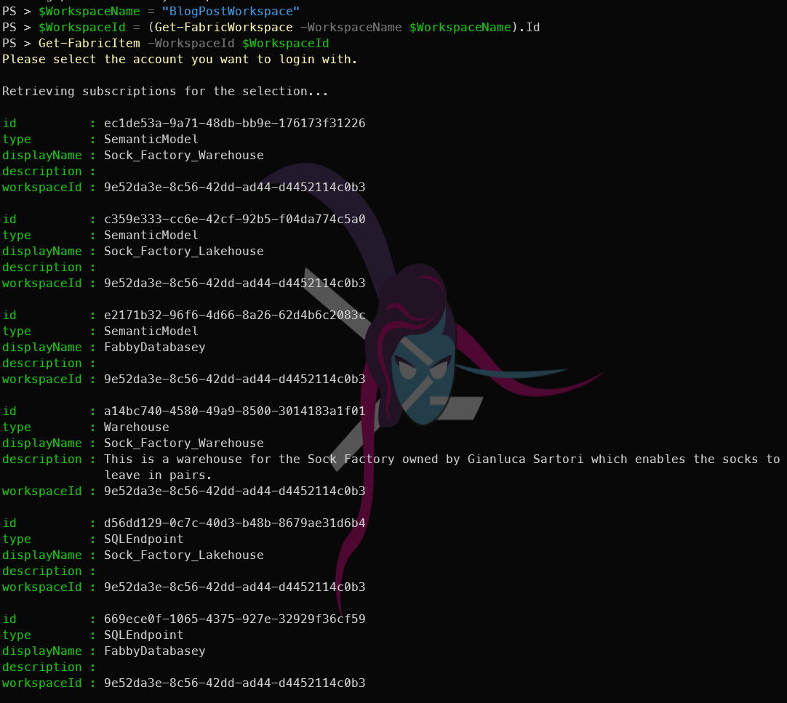
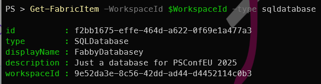
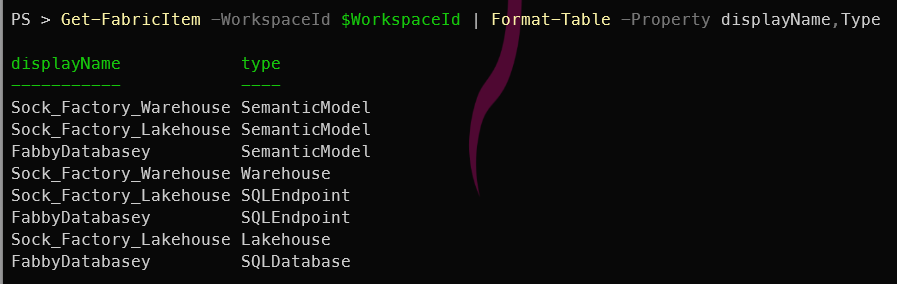
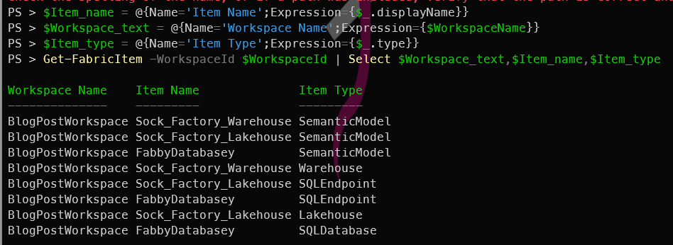
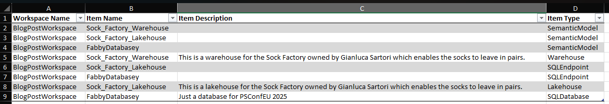

## Introduction

Having created a [workspace, a lakehouse, a warehouse, a Fabric SQL database previously](https://blog.robsewell.com/categories/microsoft-fabric/), it's time to move onto something a little more interesting. I was getting bored writing the same post over and over again, so I thought I would show you how to list the items in a Fabric Workspace using PowerShell. This command was super useful for me today to answer the question "What do they have in this workspace?" and I hope it will be useful for you too.

## What is FabricTools?
We are going to use [FabricTools](https://www.powershellgallery.com/packages/FabricTools), a PowerShell module that simplifies the management of Microsoft Fabric resources. You can find it on GitHub at [FabricTools](https://github.com/dataplat/FabricTools). It has been developed and is maintained by members of the community.

## How do you list the items in a Fabric Workspace with PowerShell?
To list the items in a Fabric Workspace with PowerShell, you first need to connect to your Fabric account using the `Connect-FabricAccount` cmdlet. This cmdlet will prompt you to sign in with your Microsoft account. I like to use a secret to store my tenant ID, so I can use it in my scripts without hardcoding it. You can use the `Get-Secret` cmdlet from the [Microsoft.PowerShell.SecretManagement](https://learn.microsoft.com/en-us/powershell/module/microsoft.powershell.secretmanagement/) module to retrieve the secret.
```powershell
Connect-FabricAccount -TenantId (Get-Secret -Name beard-mvp-tenant-id -AsPlainText)
```
You can list all of the items in a Fabric Workspace by getting the Fabric Workspace and then piping it to the `Get-FabricItem` cmdlet.

```powershell
$WorkspaceName = "BlogPostWorkspace"
Get-FabricWorkspace -WorkspaceName $WorkspaceName|Get-FabricItem
```
This will list all the items in the specified Fabric Workspace. The output will include the item type, name, and other details.

[](../assets/uploads/2025/06/getfabricitems-pwsh.png)

You can also filter the items by type using the `-Type` parameter. For example, to list only the Fabric SQL databases in the workspace, you can use:

```powershell
Get-FabricWorkspace -WorkspaceName $WorkspaceName|Get-FabricItem -type sqldatabase
```
[](../assets/uploads/2025/06/getfabricitems-sqldatabases-pwsh.png)

You can also filter by other types such as lakehouse, warehouse, etc.

# It's Just PowerShell

The beauty of using PowerShell to manage Fabric resources is that you can easily script and automate these tasks. You can combine these commands with other PowerShell cmdlets to create more complex scripts that suit your needs. You can use your existing PowerShell skills and knowledge.

PowerShell makes it easy.

For example in the above items list, the output is the default output and comes out as a list of objects. You can use the `Format-Table` cmdlet to format the output in a more readable way. For example, you can use:

```powershell
Get-FabricItem -WorkspaceId $WorkspaceId | Format-Table -Property displayName,Type
```
[](../assets/uploads/2025/06/getfabricitems-table-pwsh.png)

You can update the output by using calculated properties to show the item type in a more readable way. For example, you can use:

```powershell
$Workspace_text = @{Name='Workspace Name';Expression={$WorkspaceName}}
$Item_name = @{Name='Item Name';Expression={$_.displayName}}
$Item_type = @{Name='Item Type';Expression={$_.type}}
Get-FabricItem -WorkspaceId $WorkspaceId | Select $Workspace_text,$Item_name,$Item_type
```
[](../../assets/uploads/2025/06/getfabricitems-calculated-pwsh.png)

It's PowerShell, so you can output to a csv

```powershell
Get-FabricItem -WorkspaceId $WorkspaceId | Select $Workspace_text,$Item_name,$Item_type | Export-Csv -Path "C:\temp\FabricItems.csv" -NoTypeInformation
```
It's PowerShell, so you can output to a json file

```powershell
Get-FabricItem -WorkspaceId $WorkspaceId | Select $Workspace_text,$Item_name,$Item_type | ConvertTo-Json | Out-File -FilePath "C:\temp\FabricItems.json"
```

It's PowerShell, so you can output to an Excel file

```powershell
$Item_name = @{Name='Item Name';Expression={$_.displayName}}
$Workspace_text = @{Name='Workspace Name';Expression={$WorkspaceName}}
$Item_type = @{Name='Item Type';Expression={$_.type}}
$Item_description = @{Name='Item Description';Expression={$_.description}}

$ExcelConfig = @{
    Path = $ExcelFile
    AutoSize = $true
    WorksheetName = $WorkspaceName
    AutoFilter = $true
    TableStyle = 'Light1'
}

Get-FabricItem -WorkspaceId $WorkspaceId | Select-Object $Workspace_text, $Item_name, $Item_description, $Item_type | Export-Excel @ExcelConfig
```

[](../assets/uploads/2025/06/exceloutput.png)

There are obviously many more things you can do with PowerShell and indeed with FabricTools, but I hope this gives you a good starting point to explore the possibilities.