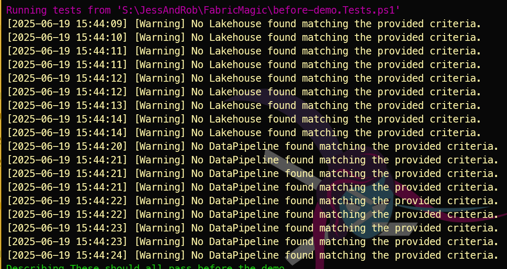
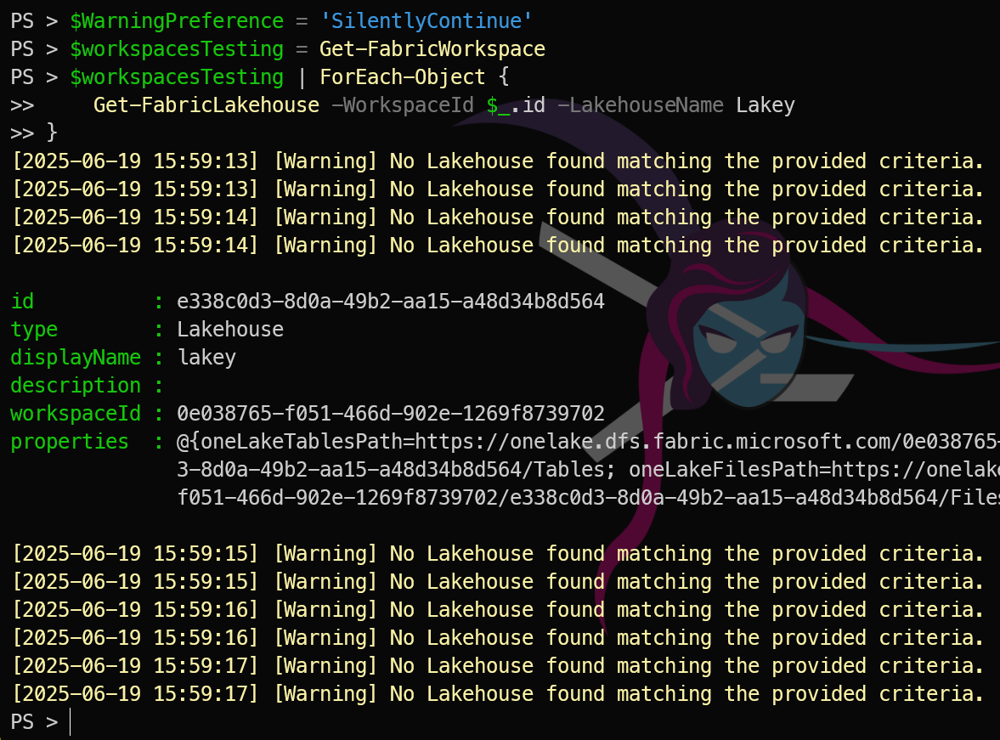
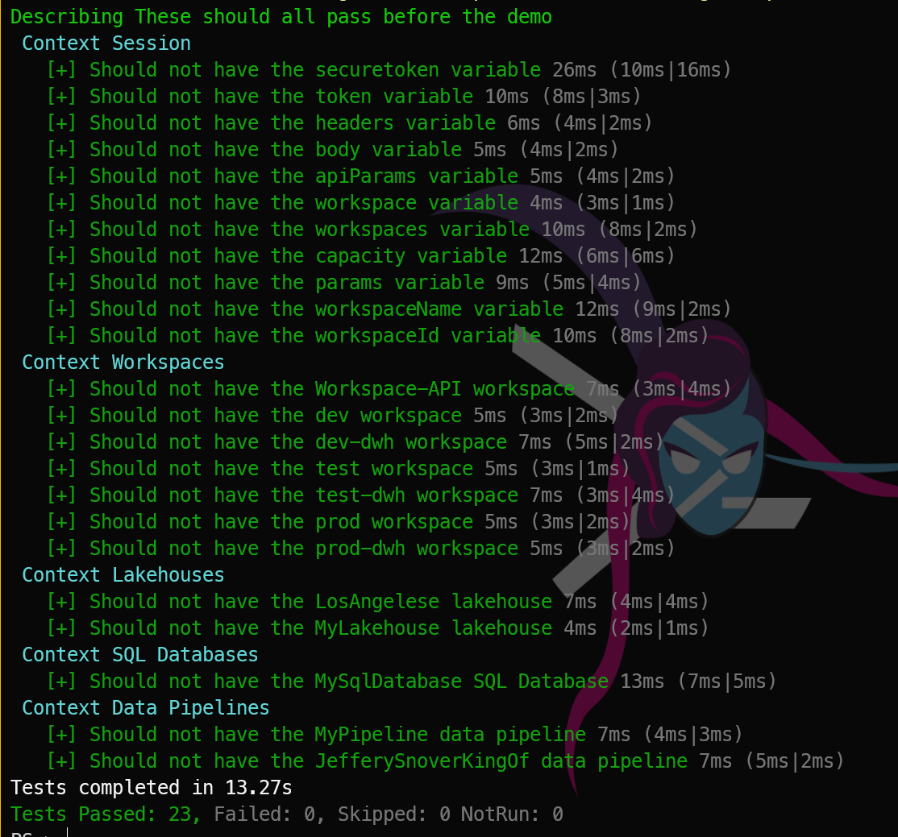
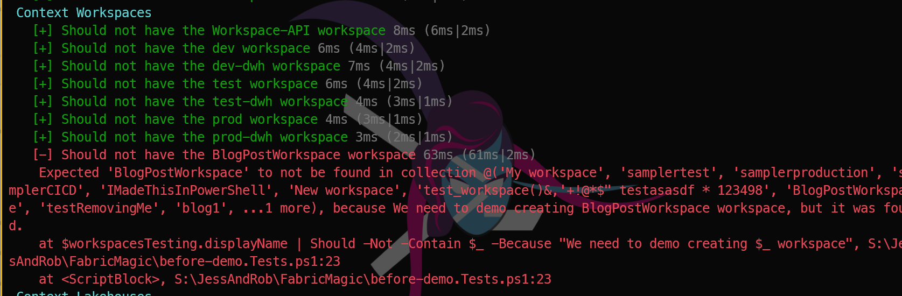

## Introduction

Next week is the [PowerShell Conference Europe 2025](https://psconf.eu), and Jess Pomfret [B](https://jesspomfret.com) [S](https://bsky.app/profile/jpomfret.co.uk)and I will be presenting a session Microsoft Fabric for the PowerShell Pro

Of course we will be demonstrating [FabricTools](https://www.powershellgallery.com/packages/FabricTools?WT.mc_id=DP-MVP-5002693), a PowerShell module that simplifies the management of Microsoft Fabric resources. You can find it on GitHub at [FabricTools](https://github.com/dataplat/FabricTools?WT.mc_id=DP-MVP-5002693). FabricTools provides functions to create, update, and delete Fabric Lakehouses and other resources. It has been developed and is maintained by members of the community.

## Pester Testing

This post is not about validating our PowerShell code using [Pester](https://www.powershellgallery.com/packages/Pester?WT.mc_id=DP-MVP-5002693) but rather about validating the Fabric resources we create using PowerShell. Pester is a testing framework for PowerShell that allows you to write tests for your PowerShell code. You can find blog posts I have written about that [here](https://blog.robsewell.com/tags/pester/). It is widely used in the PowerShell community to ensure that code works as expected.

However, I always say that

> If you can *get* it with PowerShell then you can *test* it with Pester.

## So how do you test Fabric resources with Pester?

Jess and I wanted the demos to work at the PowerShell Conference Europe, obviously. As we will be creating things and deleting things it is important that before our session we ensure that the things that should be there are there and the things that should not are not. Indeed we have been doing it this way for [a long time](https://blog.robsewell.com/blog/pester-for-presentations-ensuring-it-goes-ok/). Yes! Jess and I have been PowerShelling for ages!!

Anyway. The important thing is to get information with PowerShell and test it with Pester.

## Saving resources

In order to save resources, CPU cycles and avoid API limitations we follow the [DRY (Don't Repeat Yourself)](https://www.bing.com/ck/a?!&&p=dc75784840f9151e04d8364fc2f7a968cd10e1fcab58bfaa30dcd0db9c04bfebJmltdHM9MTc1MDI5MTIwMA&ptn=3&ver=2&hsh=4&fclid=3d0abf52-3d4b-6cda-1806-abf63cf06d16&psq=dry+coding&u=a1aHR0cHM6Ly9lbi53aWtpcGVkaWEub3JnL3dpa2kvRG9uJTI3dF9yZXBlYXRfeW91cnNlbGY&ntb=1)

In Pester we can do that using a `BeforeAll` code block which will run (surprisingly) before all of the tests.

To gather all of the required information we can do this

```
Describe "These should all pass before the demo" {
    BeforeAll {
        $workspacesTesting = Get-FabricWorkspace
        $lakehousesTesting = $workspacesTesting | ForEach-Object {
            Get-FabricLakehouse -WorkspaceId $_.id
        }
        $sqlDatabasesTesting = $workspacesTesting | Get-FabricSqlDatabase
        $dataPipelinesTesting = $workspacesTesting | ForEach-Object {
            Get-FabricDataPipeline -WorkspaceId $_.id
        }
    }
}
```

This will add the details of the Fabric Workspaces, Lakehouses, Fabric SQL databases and Data Pipelines into variables to be used in the tests.

What we are doing is getting all of the workspaces with

```
$workspacesTesting = Get-FabricWorkspace
```

and then getting all of the Lakehouses, Fabric SQL Databases and Data Pipelines in those Workspaces. You will be able to achieve the same thing with every type of Fabric Resource using the FabricTools module.

## Why two different ways?

Smart eyes will notice that there are two different methods of getting all of the resource types and that one of them does not follow normal PowerShell practice of passing arrays of objects along the pipeline to the next command.

```
$sqlDatabasesTesting = $workspacesTesting | Get-FabricSqlDatabase

$dataPipelinesTesting = $workspacesTesting | ForEach-Object {
    Get-FabricDataPipeline -WorkspaceId $_.id
}
```

This is because FabricTools is at the stage of the project where a number of different authors have all combined their code and coding practices. Consistency is being applied as we move through the code and encourage good practices that will enable seasoned PowerShell professionals to be able to pick up the code quickly as it will follow usual rules and not have any quirks.

## Quirks

Speaking of quirks there is another one with some of the commands in the Fabric Tools module that will catch out PowerShell professionals right at this moment (June 2025)

When you run the `BeforeAll` block you will receive this *warning* message

[](./../assets/uploads/2025/06/writemessage.png)

PowerShell folk would usually make use of the `$WarningPreferences` default value and ignore the warning with

```
$WarningPreference = 'SilentlyContinue'
```

however this will not work as you expect

[](./../assets/uploads/2025/06/writemessagewarning.png)

Why do I mention this?

This is where YOU can help us. We have issues for these (and other things) [open in our repo](https://github.com/dataplat/FabricTools/issues)

Maybe you can help to fix [the piping for commands issue](https://github.com/dataplat/FabricTools/issues/75) or the [Write-Message Warning issue](https://github.com/dataplat/FabricTools/issues/136) or many of the others.

# Hey I want to test my Fabric with Pester.

Ok, I shall get back to the point. To test with Pester, once you have gathered all of the information in your `BeforeAll` block you can use test cases like this to loop through. (DRY remember). Again, as with all good PowerShell it will be exactly as is expected (especially when the code is mre consistent)

You can follow this process

```
Context "Workspaces" {
    It "Should not have the <_> workspace" -TestCases @('Workspace-API', 'dev', 'dev-dwh', 'test', 'test-dwh', 'prod', 'prod-dwh') {
        $workspacesTesting.displayName | Should -Not -Contain $_ -Because 'we will demo creating it'
    }
}
```
You have a `Context` block to keep your tests organised and then an `It` block which is your test. You pass a `TestCases` array `@()` to the `It` block. In the title you refer to the *this one* in the loop by using `<_>` and in the test by using `$_`

Then you test with *What I got* `|` *what i expected* `-Because` *This is the reason*

In the example above, the array of workspace names that was returned should not contain any of the values in the TestCases. This is what it looks like when it passes

[](./../assets/uploads/2025/06/passingpester.png)

and when it fails

[](./../assets/uploads/2025/06/pesterfails.png)


Happy Pestering :-)