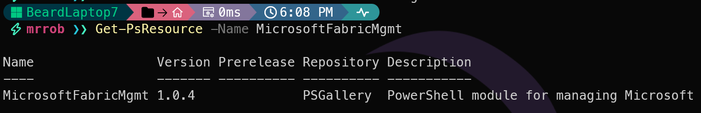

## Introduction

Yesterday I [introduced the MicrosoftFabricMgmt module](https://blog.robsewell.com/blog/introducing-microsoftfabricmgmt-managing-microsoft-fabric-with-powershell/) and explained what it can do. Today we are getting hands on — installing the module, sorting out dependencies, and making your first connection to Microsoft Fabric.

By the end of this post you will have the module installed, be authenticated, and have your first list of Fabric workspaces in your terminal.

## Prerequisites

MicrosoftFabricMgmt requires **PowerShell 7 or later**. It will not work on Windows PowerShell 5.1. If you are still on 5.1, now is a great time to upgrade. You can download PowerShell 7 from [here](https://learn.microsoft.com/en-us/powershell/scripting/install/installing-powershell?WT.mc_id=DP-MVP-5002693).

You can check your version with:

```powershell
$PSVersionTable.PSVersion
```

[](../../assets/uploads/2026/02/psversion.png)

## Installing the Module

Installing from the [PowerShell Gallery](https://www.powershellgallery.com/packages/MicrosoftFabricMgmt?WT.mc_id=DP-MVP-5002693) is the recommended approach:

```powershell
Install-PsResource -Name MicrosoftFabricMgmt
```

The module has dependencies that will be installed automatically:

| Module | Minimum Version | Purpose |
|--------|----------------|---------|
| PSFramework | 5.0.0 | Logging and configuration |
| Az.Accounts | 5.0.0 | Azure authentication |
| Az.Resources | 6.15.1 | Azure resource management |
| MicrosoftPowerBIMgmt | 1.2.1111 | Power BI integration |

If you have already installed the module and want to update to the latest version:

```powershell
Update-PsResource -Name MicrosoftFabricMgmt
```

Once installed, verify it is available:

```powershell
Get-PsResource -Name MicrosoftFabricMgmt
```
[](../../assets/uploads/2026/02/get-psresource.png)

## Authentication

Before any cmdlet will work you need to authenticate. This is done with `Set-FabricApiHeaders`.

For interactive use — which is what we will cover today — this triggers a browser authentication flow using your Microsoft account.

```powershell
Set-FabricApiHeaders -TenantId "xxxxxxxx-xxxx-xxxx-xxxx-xxxxxxxxxxxx"
```

You will need your **Tenant ID**. You can find this in the [Azure portal](https://portal.azure.com/?WT.mc_id=DP-MVP-5002693) under Azure Active Directory, or by running:

```powershell
# If you have Az.Accounts installed and have Connected-AzAccount, you can get the tenant ID with:
(Get-AzContext).Tenant.Id
```

I like to store mine as a secret so I do not have to hardcode it in scripts. I use the [Microsoft.PowerShell.SecretManagement](https://learn.microsoft.com/en-us/powershell/module/microsoft.powershell.secretmanagement/?WT.mc_id=DP-MVP-5002693) module for this:

```powershell
Set-FabricApiHeaders -TenantId (Get-Secret -Name FabricTenantId -AsPlainText)
```

After running `Set-FabricApiHeaders`, your browser or a window will open and prompt you to sign in.

[](../../assets/uploads/2026/02/setfabricapi.png)

Once authenticated, the module stores your token securely for use in future commands in this session. It will also show how long the token is valid for, so you know when you will need to re-authenticate.

[](../../assets/uploads/2026/02/postlogin.png)


When the token expires, you will need to re-authenticate, any MicrosoftFabricMgmt commands will inform you with a helpful message.

[](../../assets/uploads/2026/02/tokenrunout.png)

## Breaking Changes

You will also notice when importing that you get some pretty blue text informing about breaking changes. This is because this version of the module contains some breaking changes from the previous version

## What About Service Principals and Managed Identity?

The module also supports **Service Principals** (ideal for CI/CD pipelines and scheduled tasks) and **Managed Identity** (ideal for workloads running on Azure VMs, Azure Functions, or Azure DevOps agents). We will cover those in a dedicated post later in the series. For now, interactive authentication is the way to go.

## Your First Commands

With authentication sorted, let us make sure everything is working:

```powershell
# List all workspaces you have access to
Get-FabricWorkspace
```

[![Get-FabricWorkspace command output displaying a formatted table with four workspaces. The table columns are Capacity Name, Workspace Name, and Type. Capacity Name shows N/A for most entries except one Trial entry. Workspace names include My workspace (Personal type), BlogPostWorkspace (Workspace type), BeardandPurple (Workspace type), and Microsoft Fabric Capacity Metrics (Workspace type). The output demonstrates the modules intelligent formatting that displays human-readable workspace names instead of GUIDs](../assets/uploads/2026/02/get-fabricworkspace.png)](../../assets/uploads/2026/02/get-fabricworkspace.png)

You should see your workspaces listed with their display names. Notice how the output shows the **Capacity Name** alongside the workspace details — not raw GUIDs. That is the intelligent output formatting built into the module, and it is the subject of tomorrow's post.

```powershell
# Get details of a specific workspace by name
Get-FabricWorkspace -WorkspaceName Strava
# Get all the details in a list showing all properties
Get-FabricWorkspace -WorkspaceName workyII | Format-List
# You only need single quotes for names with spaces.
Get-FabricWorkspace -WorkspaceName 'Humans read words not GUIDS'
```

[![Get-FabricWorkspace command output in dark PowerShell terminal showing a formatted table with Capacity Name, Workspace Name, and Type columns. The table displays multiple workspaces: My workspace (Personal type, N/A capacity), BlogPostWorkspace, BeardandPurple, Microsoft Fabric Capacity Metrics, Strava, NoReports, worky1, workyII, and Humans read words not GUIDS (all Workspace type, N/A capacity except one Trial capacity entry). The command prompt shows mrrob >> in green text. The output demonstrates the modules intelligent formatting that displays human-readable workspace names instead of GUIDs](../assets/uploads/2026/02/get-fabricworkspace1.png)](../../assets/uploads/2026/02/get-fabricworkspace1.png)

## Confirming Module Configuration

PSFramework powers the module's configuration system. You can inspect all the configuration settings with:

```powershell
Get-PSFConfig -Module MicrosoftFabricMgmt
```
[![Terminal output showing Get-PSFConfig results for MicrosoftFabricMgmt module settings. The table displays configuration properties including Api.BaseUrl (base URL for Microsoft Fabric API endpoints), Api.ResourceUrl (Azure resource URL for token acquisition), Api.RetryBackoffMultiplier (exponential backoff multiplier set to 2), Api.RetryMaxAttempts (maximum retry attempts set to 3), Api.TimeoutSeconds (default timeout of 30 seconds), Auth.TokenRefreshThresholdSeconds (token refresh threshold of 300 seconds), and Json.DefaultDepth (default JSON conversion depth of 10). Dark terminal background with green command prompt text showing mrrob >>](../assets/uploads/2026/02/config.png)](../../assets/uploads/2026/02/config.png)
This shows things like the API base URL, timeout settings, retry attempts, and backoff multiplier. You can adjust these if needed — for example, if you want more retry attempts for a flaky network:

```powershell
Set-PSFConfig -Module MicrosoftFabricMgmt -Name Api.RetryMaxAttempts -Value 5
```

## You Are Ready

That is it! The module is installed, you are authenticated, and you have your workspaces. Tomorrow we look at something that makes this module stand out — the intelligent output formatting that turns GUIDs into names and makes your results actually readable. See you then.

You can find all of the blog posts about MicrosoftFabricMgmt here - [MicrosoftFabricMgmt Blog Posts](https://blog.robsewell.com/tags/microsoftfabricmgmt/)
