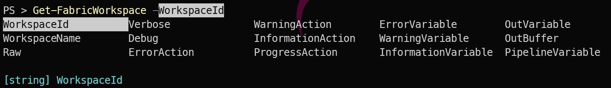

## Introduction

Most of this blog post is going to be more about PowerShell in general than this specific module. The MicrosoftFabricMgmt module has over 295 cmdlets, which can be overwhelming at first glance. But PowerShell's built-in discovery tools make it easy to find what you need. Knowing how to use a command is always available in the shell itself. You can find out how to use a function, what parameters it takes, and see examples of its usage without ever leaving the command line.

I have been using PowerShell for over a decade, and I still rely heavily on `Get-Command` and `Get-Help` to explore new modules and refresh my memory on ones I haven't used in a while. In this post, I'll show you how to use these tools effectively to navigate the MicrosoftFabricMgmt module.

## Finding Commands with Get-Command

The most direct way to explore what the module offers:

```powershell
# Every cmdlet in the module DONT run this there are 295+ cmdlets\11
Get-Command -Module MicrosoftFabricMgmt

# Just the Get cmdlets
Get-Command -Module MicrosoftFabricMgmt -Verb Get

# Everything related to Lakehouses
Get-Command -Module MicrosoftFabricMgmt -Noun *Lakehouse*

# Find by partial name when you are not sure of the exact noun
Get-Command -Module MicrosoftFabricMgmt -Name *Notebook*
```

That last pattern — using a wildcard on the noun — is what I reach for first when exploring a resource type I have not used yet. `*Notebook*` returns `Get-FabricNotebook`, `New-FabricNotebook`, `Update-FabricNotebook`, and `Remove-FabricNotebook`. You can immediately all of the options for that resource.

## Reading the Help with Get-Help

Every cmdlet has full help built in:

```powershell
# Full help including all parameters and notes
Get-Help Get-FabricWorkspace -Full

# Just the examples — often all you need
Get-Help Get-FabricWorkspace -Examples

# List available parameters quickly
Get-Help Get-FabricWorkspace -Parameter *
```

The `-Examples` flag is the most useful for day-to-day work. The examples are practical and show common parameter combinations. When I am picking up a cmdlet I have not used before, I run the examples first to understand the expected usage.

## Tab Completion

Tab completion works throughout the module. After `Get-Fabric`, press Tab to cycle through all `Get-Fabric*` cmdlets. After specifying a cmdlet name, press Tab after a dash to see all available parameters. Honestly, I would probably tab through after one more letter than that, just to confirm the exact noun and verb I want, but you get the idea.

```powershell
# Type this and press Tab to cycle through options
Get-FabricW<Tab>

# Type this and press Tab to see parameters
Get-FabricWorkspace -<Tab>

#Type this and press CTRL+Space to see all parameters
Get-FabricWorkspace -<Ctrl+Space>
```

[](../../assets/uploads/2026/03/tabspace.png)

This is faster than remembering exact names, and it confirms that a parameter exists before you commit to it.

## The 48 Resource Types

MicrosoftFabricMgmt covers 48 different Fabric resource types. Here is a rough grouping:

**Storage**
- Lakehouse, Warehouse, SQLDatabase, SQLEndpoint

**Compute and Orchestration**
- Notebook, DataPipeline, Dataflow

**Real-Time Intelligence**
- Eventhouse, KQLDatabase, KQLDashboard, KQLQueryset, Eventstream

**Semantic Models and Reporting**
- SemanticModel, Report, PaginatedReport, Dashboard

**Workspace and Access**
- Workspace, WorkspaceRoleAssignment, Capacity

**Admin (tenant-wide)**
- AdminWorkspace, AdminItem, ActivityEvent

## Tomorrow

Tomorrow we look at logging — how MicrosoftFabricMgmt uses PSFramework to give you structured, queryable log messages that make it easy to understand exactly what your scripts have been doing. See you then.

You can find all of the blog posts about MicrosoftFabricMgmt here - [MicrosoftFabricMgmt Blog Posts](https://blog.robsewell.com/tags/microsoftfabricmgmt/)
