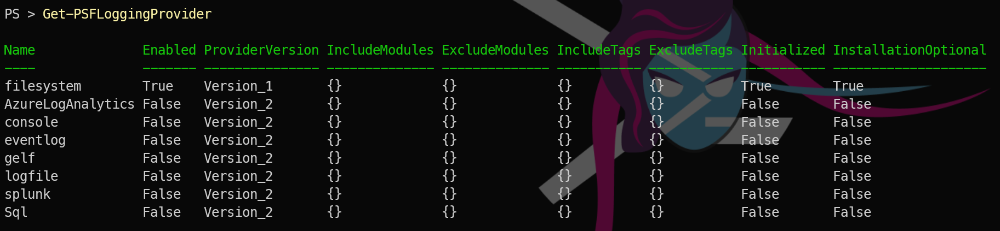

## Introduction

If you have ever come back to a script the next morning and thought "what on earth happened last night?", you understand why logging matters. `Write-Host` and `Write-Verbose` are fine for interactive use, but in automation — scheduled tasks, CI/CD pipelines, long-running jobs — you need something more structured. Something you can query, filter, and persist across sessions, something that you can provide to your team or support or auditors.

MicrosoftFabricMgmt uses [PSFramework](https://psframework.org/) for all its internal logging, and that capability is available directly to you.

## How the Module Logs Internally

Every significant action inside MicrosoftFabricMgmt writes a structured log message using `Write-PSFMessage`. You do not need to configure anything to benefit from this — the messages are written automatically as cmdlets run.

The log levels used are:

| Level | Description |
|-------|-------------|
| `Debug` | Detailed internal state, usually not needed day-to-day |
| `Verbose` | What the cmdlet is doing step-by-step |
| `Host` | Summary output, always visible |
| `Warning` | Something unexpected happened but the cmdlet continued |
| `Error` | The cmdlet could not complete its work |

## Viewing the In-Memory Log

PSFramework keeps a rolling in-memory log of all messages from the current session. Access it with:

```powershell
Get-PSFMessage
```
[![PowerShell terminal output showing Get-PSFMessage results with columns for Timestamp, FunctionName, Line, Level, TargetObject, and Message. The output displays verbose and debug level logging entries from MicrosoftFabricMgmt module initialization, authentication steps, and API calls to Microsoft Fabric endpoints dated 07/03/2026 at 17:13-17:14. Each row documents sequential operations including module framework configuration, API authentication, token validation, capacity resource queries, and successful API responses with code 200, demonstrating the structured logging captured during an automated Fabric operation](assets/uploads/2026/03/Getpsfmessage.png)](assets/uploads/2026/03/Getpsfmessage.png)

This returns all log entries. You can filter by level, function name, or timestamp:

```powershell
# Show only verbose messages
Get-PSFMessage -Level Verbose

# Show messages from the last 5 minutes
Get-PSFMessage | Where-Object { $_.Timestamp -gt (Get-Date).AddMinutes(-5) }

```

This is invaluable after running a large automation script. Instead of hoping something printed to the console at the right moment, you can inspect exactly what happened.

## Default Logging to a file
By default, PSFramework also writes all messages to a log file in the user's profile directory. You can always find the path with:

```powershell
Get-PSFConfigValue -Name PSFramework.Logging.FileSystem.LogPath
```
This file is a plain text log that you can open with any text editor. It contains all of the same messages that you see from Get-PSFMessage.

## Other Logging Destinations
PSFramework supports multiple logging destinations (called "providers") out of the box, You can list thme and see which are enabled with:

```powershell
Get-PSFLoggingProvider
```

[](../../assets/uploads/2026/03/loggingproviders.png)

which will show you all the providers available and which are currently enabled.

All the details about logging providers and how to configure them are [in the PSFramework documentation](https://psframework.org/docs/category/logging), but the key point is that you can easily send your MicrosoftFabricMgmt logs to Azure Log Analytics, Splunk, or any other system you use for log aggregation and analysis even a SQL database if you want.


Tomorrow we look at the other half of resilient automation: error handling and retry logic. What happens when a Fabric API call fails? The module handles a lot of it for you. See you then.
