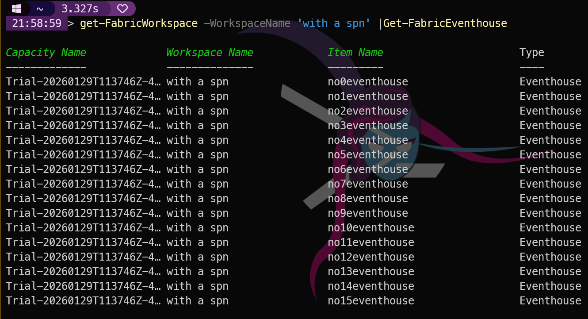
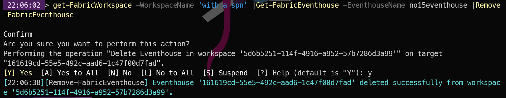

## Introduction

Real-Time Intelligence (RTI) is Microsoft Fabric's answer to streaming data workloads. If you are ingesting telemetry, IoT data, clickstreams, or any high-velocity data that needs querying with low latency, this is the part of Fabric you want. MicrosoftFabricMgmt supports the full set of RTI resources: Eventhouses, KQL Databases, KQL Dashboards, KQL Querysets, and Eventstreams.

## Eventhouses

An Eventhouse is the container for Real-Time Intelligence data. Think of it as the workspace-level home for your KQL databases — you create an Eventhouse first, then create KQL Databases inside it.

### Getting Eventhouses

```powershell
# All Eventhouses in a workspace
get-FabricWorkspace -WorkspaceName 'with a spn' |Get-FabricEventhouse

# A specific Eventhouse by name
get-FabricWorkspace -WorkspaceName 'with a spn' |Get-FabricEventhouse -EventhouseName "TelemetryStore"

# All Eventhouses across all workspaces
Get-FabricWorkspace | Get-FabricEventhouse
```

[](../../assets/uploads/2026/03/geteventhouse.png)

### Creating an Eventhouse

```powershell
$eventhouse = New-FabricEventhouse `
    -WorkspaceId $workspace.id `
    -EventhouseName "TelemetryStore" `
    -EventhouseDescription "Real-time telemetry data store"

```

### Removing an Eventhouse

```powershell
get-FabricWorkspace -WorkspaceName 'with a spn' |Get-FabricEventhouse -EventhouseName no15eventhouse |Remove-FabricEventhouse
```

[](../../assets/uploads/2026/03/remove-eventhoues.png)


## Eventstreams

An Eventstream is an event ingestion pipeline — it connects event sources (Event Hubs, IoT Hub, Kafka, etc.) to destinations (Eventhouse, Lakehouse, Data Activator). MicrosoftFabricMgmt lets you create and manage Eventstreams as Fabric items.

Guess what? Managing Eventstreams is just as easy as Eventhouses:

```powershell
# All Eventstreams in a workspace
get-FabricWorkspace -WorkspaceName 'with a spn' |Get-FabricEventstream

# A specific Eventstream by name
get-FabricWorkspace -WorkspaceName 'with a spn' |Get-FabricEventstream -EventstreamName "IoTIngestion"

# Create an Eventstream
$eventstreamParams = @{
    WorkspaceId          = $workspace.id
    EventstreamName      = "IoTIngestion"
    EventstreamDescription = "IoT device event ingestion"
}

New-FabricEventstream @eventstreamParams


# Remove an Eventstream
$removeEventstreamParams = @{
    WorkspaceId  = $workspace.id
    EventstreamId = $eventstream.id
    Confirm      = $false
}

Remove-FabricEventstream @removeEventstreamParams

```

## RTI Inventory

For a governance view of your real-time infrastructure:

```powershell
$report = Get-FabricWorkspace | ForEach-Object {
    $ws = $_
    [PSCustomObject]@{
        Workspace    = $ws.displayName
        Eventhouses  = (Get-FabricEventhouse -WorkspaceId $ws.id | Measure-Object).Count
        KQLDatabases = (Get-FabricKQLDatabase -WorkspaceId $ws.id | Measure-Object).Count
        Eventstreams = (Get-FabricEventstream -WorkspaceId $ws.id | Measure-Object).Count
    }
} | Where-Object { $_.Eventhouses -gt 0 -or $_.Eventstreams -gt 0 }

$report | Sort-Object Workspace | Format-Table -AutoSize
```
[](../../assets/uploads/2026/03/report.png)

Of course, you can export this report to CSV or Excel for further analysis or sharing with your team. You can do all of the things that you need because this is PowerShell, and you have the full power of the language at your disposal.

## Tomorrow

Tomorrow we look at the Admin API — how to get a tenant-wide view of workspaces and items that goes beyond what you see as a workspace member. See you then.
