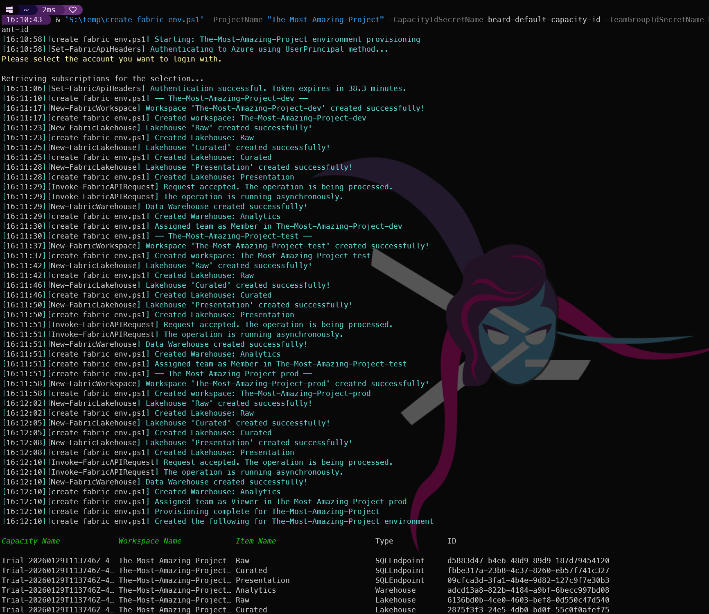
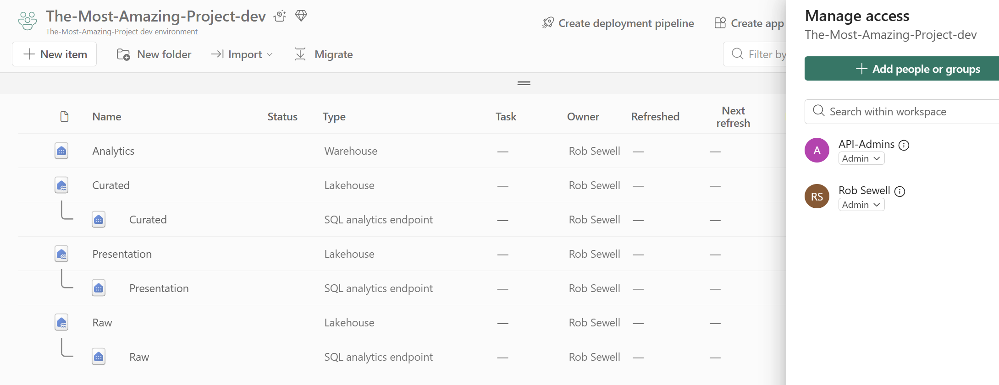

## Introduction

Over the past few posts we have worked through a number of the item choices that you can use in the MicrosoftFabricMgmt module. Today I want to bring it all together into a single, practical script that provisions a complete Fabric environment from scratch.

This is the kind of script I could use when setting up a new project. It is repeatable, idempotent (safe to run multiple times), fully logged, and handles errors gracefully.

## What We Are Building

For a "DataPlatform" project, we will create:
- Three workspaces (dev, test, prod) all assigned to a shared capacity
- A three-layer Lakehouse structure in each workspace (Raw, Curated, Presentation)
- A Warehouse in each workspace for analytical queries
- Role assignments for the data engineering team (Members in dev/test, Viewers in prod)

It is important to note that this script is designed to be run in an environment where the Microsoft Secret Management module is used to securely store sensitive information such as Capacity ID, Team Group ID, and Tenant ID. Before running this script, ensure that you have set up the necessary secrets in your secret vault with the appropriate names.

## The Script

I save this script as `Create-FabricEnvironment.ps1` and run it from my local machine or a jump box that has access to the Microsoft Fabric environment. You could also run this from any CI/CD pipeline.

```powershell
#requires -Module MicrosoftFabricMgmt

<#
Requires the use of the Microsoft Secret Management module to securely store and retrieve sensitive information such as Capacity ID, Team Group ID, and Tenant ID.
Make sure to set up the secrets in your secret vault before running this script. The secrets should
#>

[CmdletBinding(SupportsShouldProcess)]
param(
    [string]$ProjectName  = "DataPlatform",
    [string]$CapacityIdSecretName = "beard-default-capacity-id",
    [string]$TeamGroupIdSecretName  = "beard-default-team-group-id",
    [string]$TenantIdSecretName = "beard-default-tenant-id"
)

# ── Logging ───────────────────────────────────────────────────────────────────
Set-PSFLoggingProvider -Name logfile -Enabled $true -FilePath "S:\Logs\FabricProvisioning-%Date%.log"

$fn = $MyInvocation.MyCommand.Name
Write-PSFMessage -Level Host -Message "Starting: $ProjectName environment provisioning" -FunctionName $fn

# -- Validation ────────────────────────────────────────────────────────────────

$secretNames = @($CapacityIdSecretName, $TeamGroupIdSecretName, $TenantIdSecretName)
$secrets = Get-SecretInfo
foreach ($name in $secretNames) {
    if (-not ($secrets | Where-Object Name -eq $name)) {
        Write-PSFMessage -Level Error -Message "Required secret not found: $name" -FunctionName $fn
        throw "Secret not found: $name"
    }
}

# ── Authentication ─────────────────────────────────────────────────────────────
try {
    Set-FabricApiHeaders -TenantId (Get-Secret -Name $TenantIdSecretName -AsPlainText)
    Write-PSFMessage -Level Verbose -Message "Authenticated" -FunctionName $fn
}
catch {
    Write-PSFMessage -Level Error -Message "Authentication failed" -ErrorRecord $_ -FunctionName $fn
    throw
}

# ── Resolve Capacity ───────────────────────────────────────────────────────────
$capacity = Get-FabricCapacity -CapacityId (Get-Secret -Name $CapacityIdSecretName -AsPlainText)
if (-not $capacity) {
    throw "Capacity not found"
}

$WksIds = @()
# ── Environment Loop ───────────────────────────────────────────────────────────
foreach ($env in @("dev", "test", "prod")) {

    $wsName = "$ProjectName-$env"
    Write-PSFMessage -Level Host -Message "── $wsName ──" -FunctionName $fn

    # Create or retrieve workspace (idempotent)
    $ws = Get-FabricWorkspace -WorkspaceName $wsName -ErrorAction SilentlyContinue
    if (-not $ws) {
        $ws = New-FabricWorkspace -WorkspaceName $wsName -WorkspaceDescription "$ProjectName $env environment" -capacityId $Capacity.Id
        Write-PSFMessage -Level Host -Message "Created workspace: $wsName" -FunctionName $fn
    } else {
        Write-PSFMessage -Level Verbose -Message "Workspace exists: $wsName" -FunctionName $fn
    }
    $WksIds += $ws.id
    # Create Lakehouses (idempotent)
    foreach ($lhName in @("Raw", "Curated", "Presentation")) {
        $existing = Get-FabricLakehouse -WorkspaceId $ws.id -LakehouseName $lhName -ErrorAction SilentlyContinue
        if (-not $existing) {
            New-FabricLakehouse -WorkspaceId $ws.id -LakehouseName $lhName | Out-Null
            Write-PSFMessage -Level Host -Message "Created Lakehouse: $lhName" -FunctionName $fn
        }
    }

    # Create Warehouse (idempotent)
    $existingWh = Get-FabricWarehouse -WorkspaceId $ws.id -WarehouseName "Analytics" -ErrorAction SilentlyContinue
    if (-not $existingWh) {
        New-FabricWarehouse -WorkspaceId $ws.id -WarehouseName "Analytics" | Out-Null
        Write-PSFMessage -Level Host -Message "Created Warehouse: Analytics" -FunctionName $fn
    }

    # Assign team role
    $TeamGroupId = Get-Secret -Name $TeamGroupIdSecretName -AsPlainText
    $role = if ($env -eq "prod") { "Viewer" } else { "Member" }
    $wksroles = Get-FabricWorkspaceRoleAssignment -WorkspaceId $ws.id

    try {
        if(-not (
        $wksroles | Where-Object {$_.PrincipalId -eq $TeamGroupId -and $_.Type -eq "Group" -and $_.Role -eq $role})) {
        # Add-FabricWorkspaceRoleAssignment -WorkspaceId $ws.id -PrincipalId $TeamGroupId -PrincipalType "Group" -WorkspaceRole $role
        Write-PSFMessage -Level Host -Message "Assigned team as $role in $wsName" -FunctionName $fn}
        else{
            Write-PSFMessage -Level Verbose -Message "Role assignment exists for team in $wsName" -FunctionName $fn
        }
    }
    catch {
        Write-PSFMessage -Level Warning -Message "Role assignment skipped for $wsName (may already exist)" -FunctionName $fn
    }
}

Write-PSFMessage -Level Host -Message "Provisioning complete for $ProjectName" -FunctionName $fn
Write-PSFMessage -Level Host -Message "Created the following for $ProjectName environment" -FunctionName $fn

$WksIds| ForEach-Object { Get-FabricItem -WorkspaceId $_ }

Write-PSFMessage -Level Host -Message "Created the following Permissions for $ProjectName environment" -FunctionName $fn
$WksIds| ForEach-Object { Get-FabricWorkspaceRoleAssignment -WorkspaceId $_ |Select DisplayName,Type,Role }
Wait-PSFMessage
```

This is what the output looks like when I run it:

[](../../assets/uploads/2026/03/environmentcreation.png)

Here is a workspace after running the script, showing the Lakehouses and Warehouse that were created:

[](../../assets/uploads/2026/03/environmentcreationinfabric.png)


## What This Script Demonstrates

This draws on almost every post in the series:

- **Authentication** → [Getting Started](https://blog.robsewell.com/blog/microsoftfabricmgmt-getting-started/)
- **PSFramework logging** → [Structured Logging](https://blog.robsewell.com/blog/microsoftfabricmgmt-psframework-logging/)
- **Error handling patterns** → [Error Handling](https://blog.robsewell.com/blog/microsoftfabricmgmt-error-handling/)
- **Workspace management** → [Workspaces](https://blog.robsewell.com/blog/microsoftfabricmgmt-workspaces/)
- **Lakehouse creation** → [Lakehouses](https://blog.robsewell.com/blog/microsoftfabricmgmt-lakehouses/)
- **Warehouse creation** → [Warehouses and SQL Databases](https://blog.robsewell.com/blog/microsoftfabricmgmt-warehouses-and-sql-databases/)
- **Role assignments** → [RBAC](https://blog.robsewell.com/blog/microsoftfabricmgmt-rbac/)

The idempotency pattern (check before create) means you can run this script multiple times safely — it will create what is missing and skip what already exists.

## Tomorrow

Tomorrow we cover the final operational topic before we wrap up the series: Service Principals and Managed Identity — how to run automation like this without interactive authentication. See you then.
